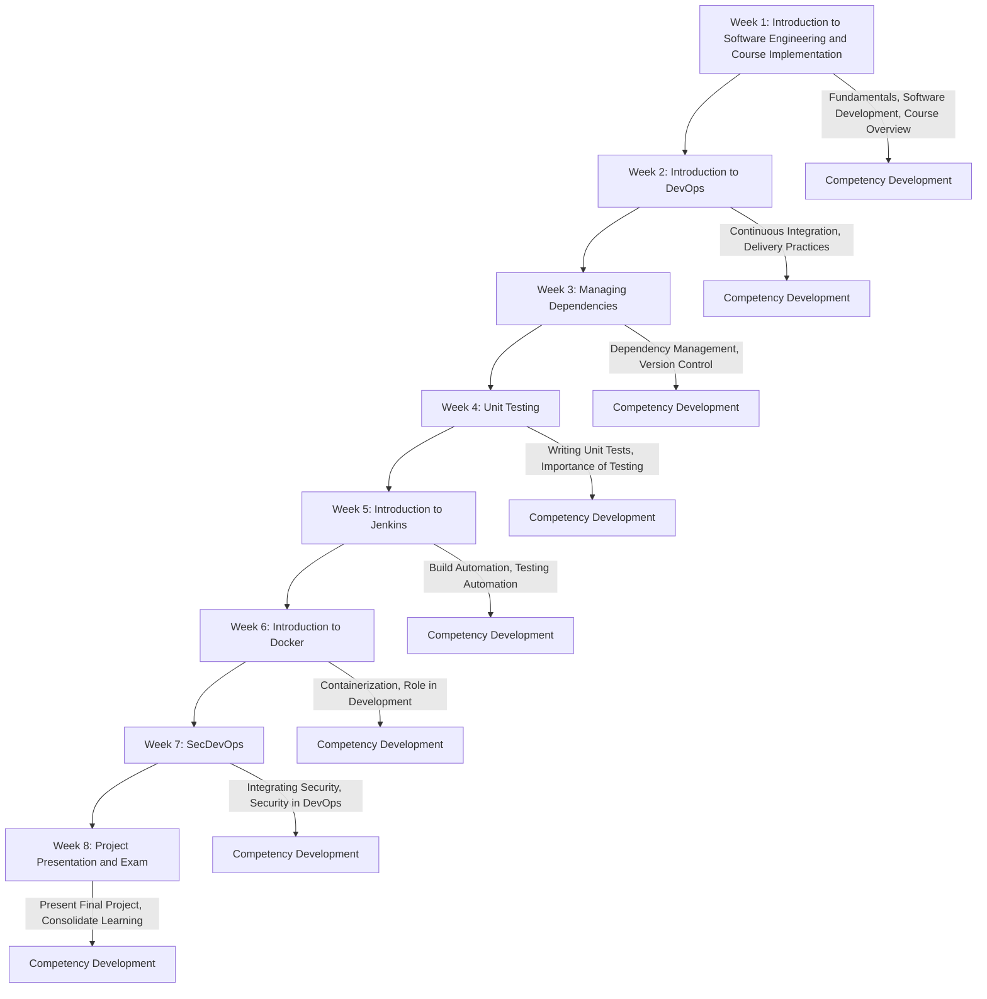

# Course Introduction: Fundamentals of Software Engineering

Welcome to the Fundamentals of Software Engineering course! This project-based course provides a comprehensive introduction to software engineering principles, with a focus on practical application through a series of weekly lectures and project assignments. The course is designed to equip you with essential skills in software development, project management, and agile methodologies.

# Student Competence Development Path

Welcome to the **Fundamentals of Software Engineering** course! This document outlines the weekly schedule and the progression of competencies throughout the course.

## Weekly Schedule

### Week 1: Introduction to Software Engineering and Course Implementation

- **Focus:** Get acquainted with the fundamentals of software engineering and course structure. Introduction to the software development process.

### Week 2: Introduction to DevOps

- **Focus:** Understand the principles and practices of DevOps, including continuous integration and delivery.

### Week 3: Managing Dependencies

- **Focus:** Learn about managing project dependencies and version control systems.

### Week 4: Unit Testing

- **Focus:** Dive into the importance of unit testing and learn how to write effective unit tests.

### Week 5: Introduction to Jenkins

- **Focus:** Explore Jenkins for automating builds, testing, and deployments.

### Week 6: Introduction to Docker

- **Focus:** Understand containerization with Docker and its role in modern software development.

### Week 7: SecDevOps

- **Focus:** Integrate security practices into the DevOps lifecycle.

### Week 8: Project Presentation and Exam

- **Focus:** Present your final project, and take the course exam. Review and consolidate your learning.

## Course Details

### Textbook

- Ian Sommerville, *Software Engineering*, 10th edition (Electronic version)
- IEEE Glossary of Software Engineering Terminology

### Lectures

- Weekly face-to-face lectures cover key software engineering concepts and processes. Examples are provided primarily in Java or Python. Attendance is mandatory.

### Project Assignment

- The course includes a project focused on software architectural planning, design, and implementation. The emphasis is on the process rather than the final product.
- Use Trello for project management, with the Scrum Master sharing the board with the teacher at [amir.dirin@metropolia.fi](mailto:amir.dirin@metropolia.fi). The project is divided into four sprints, each lasting two weeks, and extends into the SEP2 course for further development.
- Project topics are provided by the teacher, and you can choose from Java, Python, or React for implementation.

### Home/Class Assignments

- Weekly individual or group coding assignments.
- Group presentations on specific topics (25 minutes each).
- Strict deadlines for all assignments.

### Assessment Criteria

- **Course Completion:**
  - Exam (50%)
  - Group-based Project Assignment (50%)
  - Individual Assignments (Compulsory)
  - Peer Review and Self-Evaluation

- **Formula for Passing:** `P = 0.50 × PA + 0.50 × E`

**Note:** Attendance during scheduled hours is mandatory. Additional work outside of class is required to complete the project. Expect to invest approximately 12 hours per week (totaling about 100 hours) for this five-credit course.

We look forward to an engaging and productive semester, where you'll develop a solid foundation in software engineering principles and practices.
