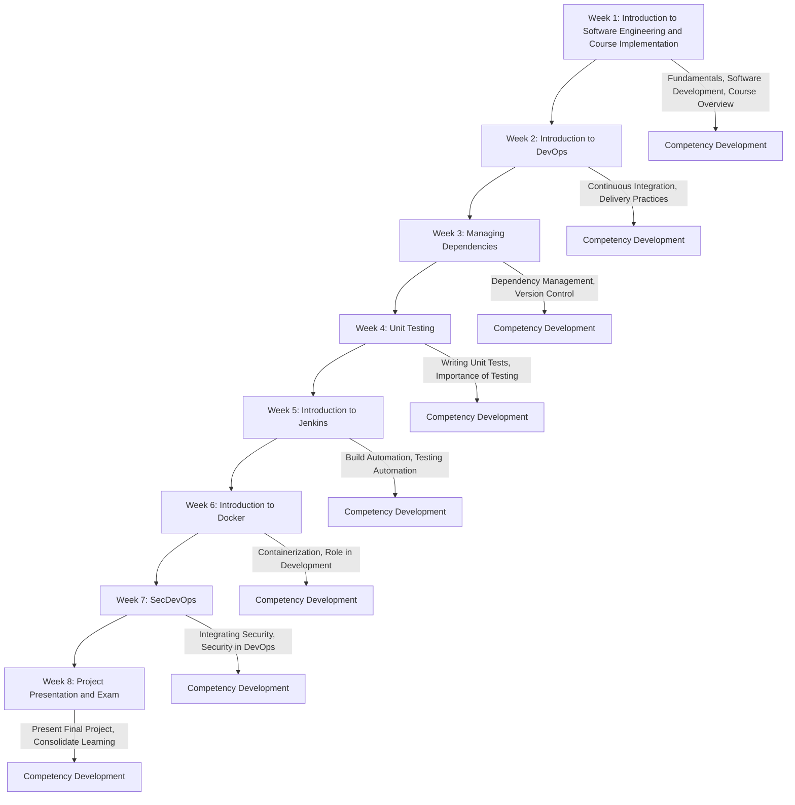

# Course Introduction: Fundamentals of Software Engineering

- Welcome to the  Software Engineering project course! This project-based course provides a comprehensive introduction to software engineering principles, with a focus on practical application through a series of weekly lectures, Home and in-class assignment in addition to **project assignments.**
- The course is designed to equip you with essential skills in **software development**, **project management**, and **agile methodologies**.

# Student Competence Development Path

Welcome to the **Fundamentals of Software Engineering** course! This document outlines the weekly schedule and the progression of competencies throughout the course.

## Weekly Schedule

### Week 1: Introduction to Software Engineering and Course Implementation

- **Focus:** Get acquainted with the fundamentals of software engineering and course structure. Introduction to the software development process.
- **Activities:**
    - [Group Setup](https://github.com/ADirin/OTP1_LectureMaterial/blob/main/Week%201/Lecture%20Assignment/Assignment1.md)
    - [Trollo Setup](https://github.com/ADirin/OTP1_LectureMaterial/blob/main/Project_Scrum/Project_Management_Trello/Introduction-To_Trello.md)
    - [Project topic selection]
    - [Presentation_Topic_Selection](https://github.com/ADirin/OTP1_LectureMaterial/blob/main/Lecture_Presentation/Topics.md)
    - *Home Assignment:* See the details of the assignements at : [Home Assignment](https://github.com/ADirin/OTP1_LectureMaterial/tree/main/Week%201/Home%20Assignment)
        

### Week 2: Introduction to DevOps
- **Focus:** Software Development Life Cycle (SDLC).
- **Focus:** Understand the principles and practices of DevOps, including continuous integration and delivery.

### Week 3: Managing Dependencies

- **Focus:** Learn about managing project dependencies and version control systems.

### Week 4: Unit Testing

- **Focus:** Dive into the importance of unit testing and learn how to write effective unit tests.

### Week 5: Introduction to Jenkins

- **Focus:** Explore Jenkins for automating builds, testing, and deployments.

### Week 6: Introduction to Docker

- **Focus:** Understand containerization with Docker and its role in modern software development.

### Week 7: SecDevOps

- **Focus:** Integrate security practices into the DevOps lifecycle.

### Week 8: Project Presentation and Exam

- **Focus:** Present your final project, and take the course exam. Review and consolidate your learning.

## Course Details

### Textbook

- Ian Sommerville, *Software Engineering*, 10th edition (Electronic version)
- IEEE Glossary of Software Engineering Terminology

### Lectures

- Weekly *online* and *face-to-face* lectures cover key software engineering concepts and processes. Examples are provided primarily in Java. Attendance is face-to-face lectures are mandatory.
    - Online lectures are often conducted via ZOOM, where we cover both the theory and the presentation.
    - **NOTE:** In compulsory face-to-face lectures, we focus on coding, setting up tools, and practical demonstrations.     

### Project Assignment (IMPORTANT)

- The course includes a project focused on software architectural [planning, designing, and implementation](https://github.com/ADirin/OTP1_LectureMaterial/tree/main/Project_Scrum). The emphasis is on **the process**, **the process**, **the process**, rather than the final product itself, even though you must have a [present](https://github.com/ADirin/OTP1_LectureMaterial/tree/main/Week%208/presentation) a functional demo at the end of the course.
    - What comes to your mind **the process**?

- Project topics are provided by the teacher, and you can choose from Java,for implementation.

- In both courses, [SEP1](https://github.com/ADirin/OTP1_LectureMaterial/tree/main) and [SEP2](https://github.com/ADirin/OTP2_LectureMaterial), we apply [Scrum](https://github.com/ADirin/OTP1_LectureMaterial/blob/main/Project_Scrum/Scrum_Agile/Introduction_Agile_Scrum.md) and use [Trello](https://github.com/ADirin/OTP1_LectureMaterial/blob/main/Project_Scrum/Project_Management_Trello/Introduction-To_Trello.md) for project management. The project team is required to update Trello during each [sprint](https://github.com/ADirin/OTP1_LectureMaterial/blob/main/Project_Scrum/Scrum_Agile/Sprint_Review_CheckList.md) and share progress with the teacher during the [sprint review](https://github.com/ADirin/OTP1_LectureMaterial/blob/main/Project_Scrum/Scrum_Agile/Spring_Review_Guidline.md) sessions.

- The project is divided into four sprints, each lasting two weeks. At the start of each sprint, the team plans the tasks, and at the end, the sprint is reviewed. Sprint reviews are typically organized on Zoom, where each team individually shares their sprint performance (completed, postponed, and in-progress tasks) with the teacher. After the meeting, the Scrum Master must submit the sprint review report on Moodle.

- This process continues in the [SEP2](https://github.com/ADirin/OTP2_LectureMaterial) course for further project development.

### Home/Class Assignments
*Note:* You are **NOT** allowed to use AI for code generation in the ckass, and project  assignment. 
- Weekly individual or group coding assignments.
- Group presentations on specific topics (25 minutes each).
- Strict deadlines for all assignments.

### Assessment Criteria

- **Course Completion:**
  - Exam (50%)
  - Group-based Project Assignment (50%)
  - Individual Assignments (Compulsory)
  - Peer Review and Self-Evaluation

- **Formula for Passing:** `P = 0.50 × PA + 0.50 × E`

**Note:** Attendance during scheduled hours is mandatory. Additional work outside of class is required to complete the project. Expect to invest approximately 12 hours per week (totaling about 100 hours) for this five-credit course.

We look forward to an engaging and productive semester, where you'll develop a solid foundation in software engineering principles and practices.

---------------------------------------------------------------------

# Sprint Schedule

|   Sprint   |   Start Date   |       End Date       | Sprint Review Meeting |
|:----------:|:--------------:|:--------------------:|:---------------------:|
|  Sprint 1  | 2024-08-19     | 2024-09-01 06:00     | 2024-09-01 06:00      |
|  Sprint 2  | 2024-09-02 06:00 | 2024-09-15 12:00     | 2024-09-15 12:00      |
|  Sprint 3  | 2024-09-16 12:00 | 2024-09-29 18:00     | 2024-09-29 18:00      |
|  Sprint 4  | 2024-09-30 18:00 | 2024-10-14 00:00     | 2024-10-14 00:00      |

