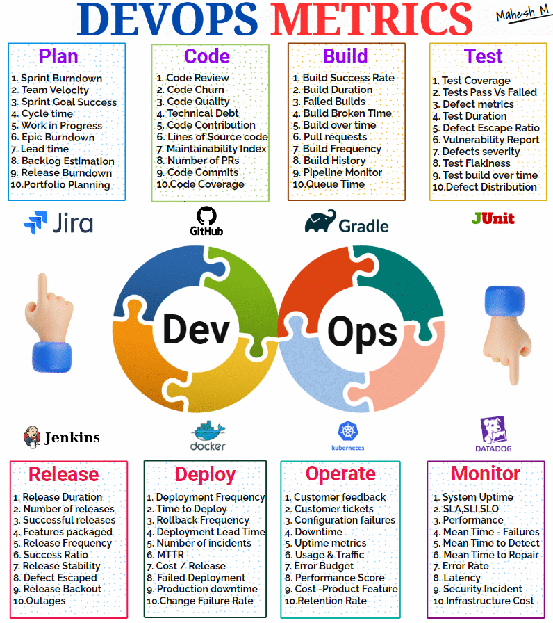
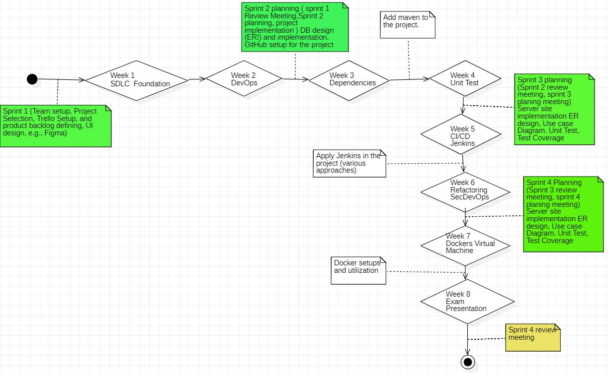
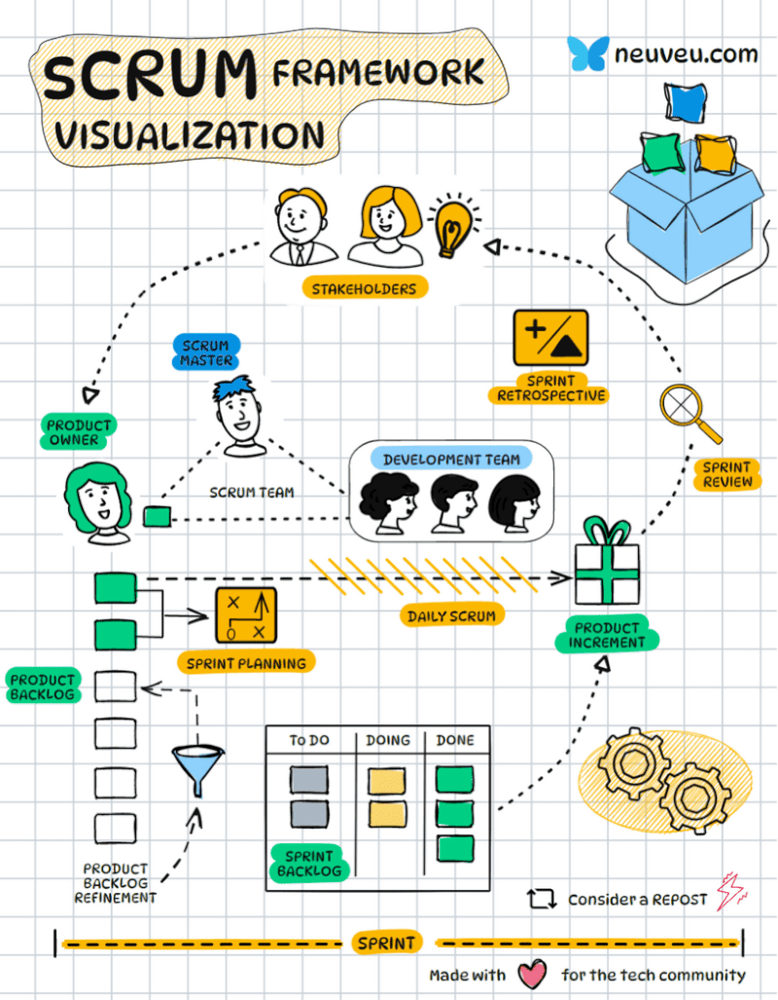

**Note:** This is a generic version of the course material. The details of the topics and assignments will be elaborated upon during the **<ins>compulsory *face-to-face* lectures</ins>**. It is important to emphasize that in this course we focus on the process, not merely the project implementation. This means that in each sprint, we apply software engineering principles and methodologies to implement the project.

´´´´mardown
| Date    | Topics  | Sprint  | Review   | Lectures           | Deadline                                |
|---------|--------|---------|----------|---------------------|------------------------------------------|
| 18.elo  |        | **Sprint1** |          | Introduction SE      | Project Selection/ Group Setup / setup Jira or Trello |
| 25.elo  |        |         |          | Introduction SE      | Project Vision/ Project plan / Github   |
| 1.syys  |        | **Sprint2** | **Review 1** | Maven               |                                          |
| 8.syys  |        |         |          | Junit/Coverage      | In-class / update Github                 |
| 15.syys |        | **Sprint3** | **Review 2** | Jenkins             |                                          |
| 22.syys |        |         |          | Jenkins             | In-class                                 |
| 29.syys |        | **Sprint4** | **Review 3** | Dockers             |                                          |
| 6.loka  |        |         |          | Dockers             | In-class                                 |
|         |        |         |          |                     | Presentation / Exam / Github Readme      |
| 20.loka |        |         | **Review 4** |                     |                                          |

´´´´

In SEP 1 we follow the DevOps approach so remember the follow figure very well.

 

>  See Example of DevOps solution: https://github.com/ADirin/DevOpsExample

- **Week 1:** We cover the basics of the software development lifecycle (SDLC) theory, initiate the project, and start Sprint 1.
- **Week 2:** We delve into DevOps principles.
- **Week 3:** We cover the concept of Maven.
- **Week 4:** We focus on unit testing and test coverage.
- **Week 5:** We explore the concept of CI/CD and utilize Jenkins in the project.
- **Week 6:** We introduce the concepts of Docker and virtual machines.
- **Week 7:** We examine the concept of refactoring and SecDevOps.
- **Week 8:** This week is dedicated to exams and project presentations by each group.

At the end of each sprint, the lecturers will be available online. All team members must participate and share their implementation with the product owner (teacher).
> **For the project implementation, we follow the agile method as defined in the Agile Manifesto. Therefore, the project implementation is accepted *if and only if* you demonstrate that you followed the agile process as described in the following figure**

# Sprint Schedule

### Sprint Requirements  

| Date    | Topics  | Sprint  | Review   | Lectures           | Deadline                                |
|---------|--------|---------|----------|---------------------|------------------------------------------|
| 18.elo  |        | Sprint1 |          | Introduction SE      | Project Selection/ Group Setup / setup Jira or Trello |
| 25.elo  |        |         |          | Introduction SE      | Project Vision/ Project plan / Github   |
| 1.syys  |        | Sprint2 | Review 1 | Maven               |                                          |
| 8.syys  |        |         |          | Junit/Coverage      | In-class / update Github                 |
| 15.syys |        | Sprint3 | Review 2 | Jenkins             |                                          |
| 22.syys |        |         |          | Jenkins             | In-class                                 |
| 29.syys |        | Sprint4 | Review 3 | Dockers             |                                          |
| 6.loka  |        |         |          | Dockers             | In-class                                 |
|         |        |         |          |                     | Presentation / Exam / Github Readme      |
| 20.loka |        |         | Review 4 |                     |                                          |

| Date    | Topics | *Sprint*    | **Review**   | Lectures            | Deadline                                |
|---------|--------|-------------|--------------|---------------------|------------------------------------------|
| 18.elo  |        | *Sprint1*   |              | Introduction SE     | Project Selection/ Group Setup / setup Jira or Trello |
| 25.elo  |        |             |              | Introduction SE     | Project Vision/ Project plan / Github   |
| 1.syys  |        | *Sprint2*   | **Review 1** | Maven               |                                          |
| 8.syys  |        |             |              | Junit/Coverage      | In-class / update Github                 |
| 15.syys |        | *Sprint3*   | **Review 2** | Jenkins             |                                          |
| 22.syys |        |             |              | Jenkins             | In-class                                 |
| 29.syys |        | *Sprint4*   | **Review 3** | Dockers             |                                          |
| 6.loka  |        |             |              | Dockers             | In-class                                 |
|         |        |             |              |                     | Presentation / Exam / Github Readme      |
| 20.loka |        |             | **Review 4** |                     |                                          |

