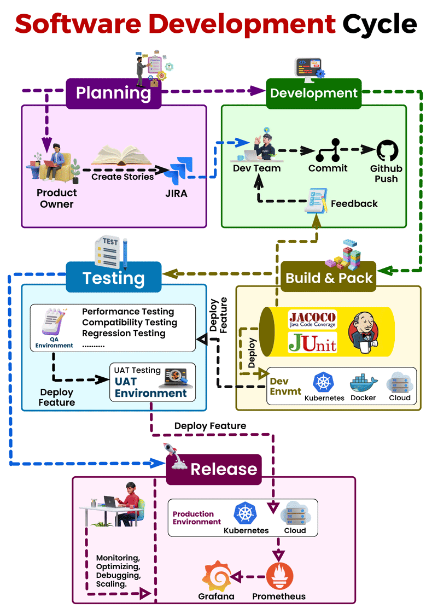

# Software Development Life Cycle (SDLC)

## Introduction to SDLC

Software Development Life Cycle (SDLC) is a structured process for developing software applications. It encompasses all the stages involved in software development from conception to deployment and maintenance.

## Importance of SDLC

- **Structured Approach**: SDLC provides a systematic and structured approach to software development, ensuring efficiency and quality.
- **Risk Management**: It helps in identifying and mitigating risks throughout the development process.
- **Quality Assurance**: By following SDLC, developers can ensure the quality of the software product meets the requirements and standards.
- **Cost Management**: SDLC helps in managing project costs by providing clear milestones and deliverables.

## History of SDLC

SDLC has evolved over the years with various methodologies and approaches. Some of the notable historical models include:

- Waterfall Model
- Spiral Model
- Iterative and Incremental Development
- Agile Manifesto

## The Most Popular Approach: Agile

Agile is an iterative and flexible approach to software development that focuses on delivering value to customers through continuous feedback and collaboration. Some key principles of Agile include:

- **Customer Satisfaction**: Responding to customer needs and delivering working software frequently.
- **Iterative Development**: Breaking down the project into small, manageable iterations or sprints.
- **Continuous Feedback**: Encouraging regular feedback from stakeholders to improve the product.
- **Adaptability**: Embracing change and adjusting plans based on feedback and evolving requirements.

## Agile Methodologies: Scrum

Scrum is one of the most widely used Agile methodologies. It follows a framework of roles, events, and artifacts to manage the software development process. Key components of Scrum include:

- **Roles**: Scrum Team (including Product Owner, Scrum Master, and Development Team)
- **Events**: Sprint Planning, Daily Standups, Sprint Review, and Sprint Retrospective
- **Artifacts**: Product Backlog, Sprint Backlog, and Increment

Scrum promotes transparency, inspection, and adaptation, enabling teams to deliver high-quality software products efficiently.

--- 

