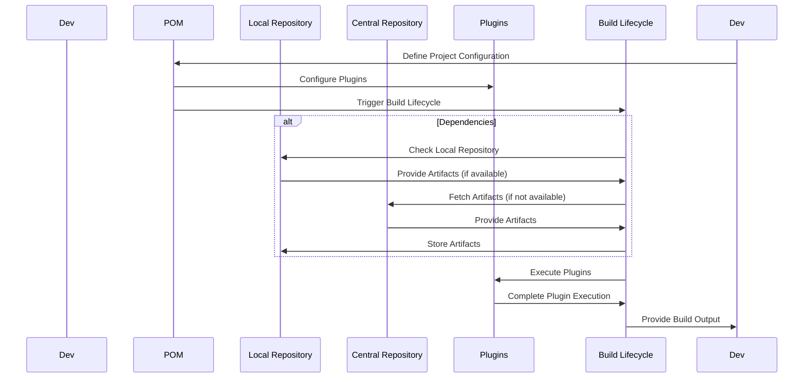
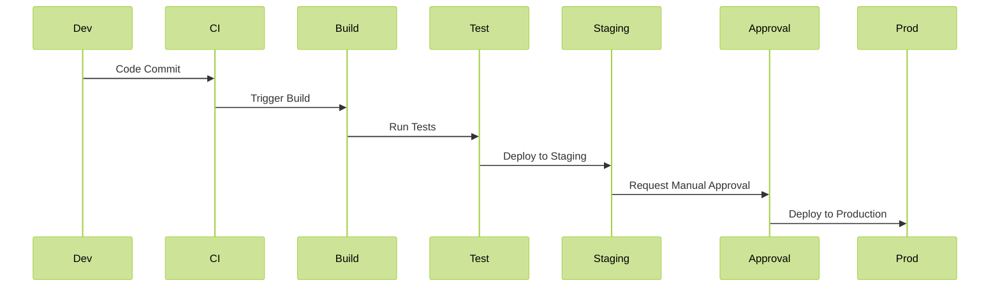
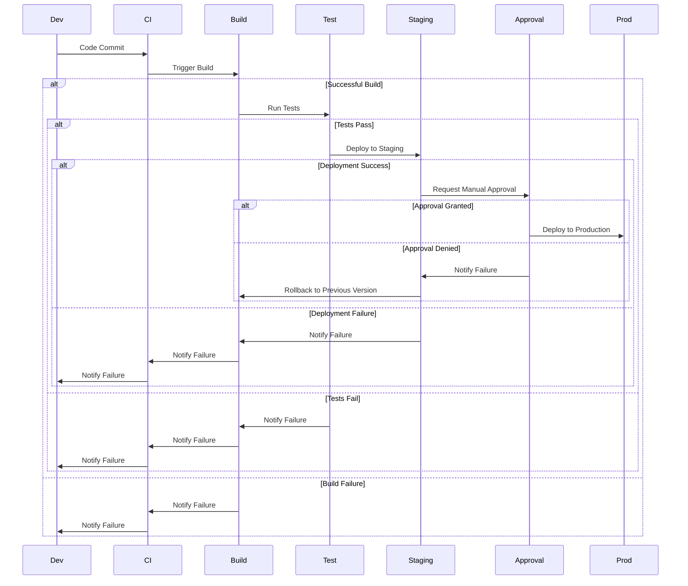

# Introduction to Maven
Apache Maven is a build automation and project management tool primarily used for Java projects. It uses a Project Object Model (POM) to manage project dependencies, build configurations, and other project-related settings.

* Maven is a powerful build automation tool primarily used for Java projects. It simplifies managing dependencies, building, and distributing Java-based projects. Maven uses a declarative approach to describe project structure, dependencies, and build processes, allowing developers to focus on coding rather than project configuration. Why use Maven:
  - Dependency Management: Automatically downloads and manages project dependencies.
  - Standardized Build Process: Provides a consistent build process across projects.
  - Extensibility: Supports a wide range of plugins to extend its functionality.
  - Convention Over Configuration: Follows conventions to minimize the need for configuration.        

> 
> 
# How Maven Works in IntelliJ IDEA
* IntelliJ IDEA, a leading Java IDE, seamlessly integrates with Maven. It recognizes Maven projects and provides built-in support for executing Maven commands directly from the IDE. IntelliJ automatically downloads dependencies specified in the pom.xml file and manages the project's build lifecycle.

## Key concpet of Maven

1. Project Object Model (POM)
The pom.xml file is the core of a Maven project. It contains the project’s configuration details such as dependencies, plugins, goals, and build settings.

Basic Structure of pom.xml:
```xml
<project xmlns="http://maven.apache.org/POM/4.0.0"
         xmlns:xsi="http://www.w3.org/2001/XMLSchema-instance"
         xsi:schemaLocation="http://maven.apache.org/POM/4.0.0 http://maven.apache.org/POM/4.0.0/maven-4.0.0.xsd">
    <modelVersion>4.0.0</modelVersion>
    <groupId>com.example</groupId>
    <artifactId>my-project</artifactId>
    <version>1.0-SNAPSHOT</version>
    <packaging>jar</packaging>
    <dependencies>
        <!-- Dependencies go here -->
    </dependencies>
    <build>
        <plugins>
            <!-- Plugins go here -->
        </plugins>
    </build>
</project>


```
- groupId: Defines the group or organization that the project belongs to.
- artifactId: Defines the name of the project.
- version: Specifies the version of the project.
- packaging: Defines the type of artifact (e.g., JAR, WAR).
- dependencies: Lists the external libraries required by the project.
- build: Contains build settings and plugins.

2. Dependencies
Dependencies are external libraries or frameworks that your project needs to compile and run. Maven manages these dependencies and their versions.

- To download dependencies, it is not needed to visit the official website of each software. 
  - It is enough to visit
           [Maven Repo](https://mvnrepository.com/)

Adding Dependencies:

```xml
<dependencies>
    <dependency>
        <groupId>junit</groupId>
        <artifactId>junit</artifactId>
        <version>4.12</version>
        <scope>test</scope>
    </dependency>
</dependencies>
```
- groupId: The group ID of the dependency.
- artifactId: The artifact ID of the dependency.
- version: The version of the dependency.
- scope: The scope of the dependency (e.g., compile, test).

3. Plugins
Plugins extend Maven's functionality. They perform specific tasks such as compiling code, running tests, packaging applications, etc.

Configuring Plugins:

```xml
<build>
    <plugins>
        <plugin>
            <groupId>org.apache.maven.plugins</groupId>
            <artifactId>maven-compiler-plugin</artifactId>
            <version>3.8.1</version>
            <configuration>
                <source>1.8</source>
                <target>1.8</target>
            </configuration>
        </plugin>
    </plugins>
</build>
```
- groupId: The group ID of the plugin.
- artifactId: The artifact ID of the plugin.
- version: The version of the plugin.
- configuration: Plugin-specific configuration options.

4. Build Lifecycle
Maven has a default build lifecycle consisting of several phases. Each phase represents a stage in the build process.

## Phases of the Default Lifecycle:
- validate: Validate the project’s structure.
- compile: Compile the source code.
- test: Run tests.
- package: Package the compiled code into a distributable format (e.g., JAR).
- verify: Perform any necessary verification (e.g., integration tests).
- install: Install the package into the local repository.
- deploy: Deploy the package to a remote repository.

### The Maven Architecher Diagram



### Running Maven Goals:
To run a specific phase or goal, use the following command:

```sh
mvn <phase>
```
For example
```sh
mvn compile
```
5. Profiles
Profiles are used to define different build configurations for various environments (e.g., development, testing, production).

Defining a Profile:

```xml
<profiles>
    <profile>
        <id>dev</id>
        <properties>
            <env>development</env>
        </properties>
    </profile>
    <profile>
        <id>prod</id>
        <properties>
            <env>production</env>
        </properties>
    </profile>
</profiles>


```
Activating a Profile:

```sh
mvn package -Pdev

```
6. Repositories
Maven uses repositories to store project artifacts and dependencies.
The central repository is the default repository, but you can also configure additional repositories.

Adding a Repository:
```xml
<repositories>
    <repository>
        <id>my-repo</id>
        <url>https://my.repo.url</url>
    </repository>
</repositories>

```
7. Multi-Module Projects
Maven supports multi-module projects, where a parent project can manage multiple sub-modules.

Parent POM Configuration:
```xml
<modules>
    <module>module-a</module>
    <module>module-b</module>
</modules>


```
Sub-Module POM Configuration:
```xml
<parent>
    <groupId>com.example</groupId>
    <artifactId>parent-project</artifactId>
    <version>1.0-SNAPSHOT</version>
</parent>


```
## Common Maven Commands
- mvn clean: Cleans up the target directory.
- mvn compile: Compiles the source code.
- mvn test: Runs tests.
- mvn package: Packages the application.
- mvn install: Installs the package into the local repository.
- mvn deploy: Deploys the package to a remote repository.


# Why Maven is Needed
* Maven addresses several common challenges in Java development:

* Dependency Management: Simplifies managing project dependencies by automatically downloading and including required libraries.
* Build Automation: Streamlines the build process, enabling developers to compile, test, package, and deploy projects with minimal effort.
* Consistent Project Structure: Enforces a standardized project structure, enhancing collaboration and understanding among developers.
* Reusability: Promotes code reusability by facilitating the creation and distribution of reusable components through repositories.

# How to Add Maven to a New Project
To add Maven to a new project in IntelliJ IDEA:

* Create a New Project: Start IntelliJ IDEA and create a new Java project.
Select Maven as the Project Type: Choose "Maven" as the project type when prompted by the IDE.
Configure Maven Settings: IntelliJ automatically configures Maven settings for the project.

# Important Considerations When Using Maven
When working with Maven, keep the following key points in mind:

* Correct POM Configuration: Ensure that the pom.xml file accurately defines project dependencies, plugins, and other configurations.
* Dependency Management: Regularly update dependencies to incorporate bug fixes, security patches, and new features.
* Build Lifecycle: Understand the Maven build lifecycle and the phases involved in the build process (e.g., compile, test, package).
Plugin Compatibility: Verify that Maven plugins used in the project are compatible with the project's Java version and other dependencies.


# Maven Lecture Demo in IntelliJ

## Introduction

In this demo, we will explore how to use Maven in IntelliJ IDEA, a popular integrated development environment for Java development. Maven simplifies the build process and manages project dependencies efficiently.

## Prerequisites

Make sure you have IntelliJ IDEA installed on your system. You can download it from [here](https://www.jetbrains.com/idea/download/).

## Demo Steps

### Step 1: Create a New Maven Project

1. Open IntelliJ IDEA and select "Create New Project" from the welcome screen.

2. Choose "Maven" from the left-hand menu and click "Next."

3. Select "Create from archetype" and choose "maven-archetype-quickstart" from the list.

4. Fill in the GroupId and ArtifactId fields with appropriate values.

5. Click "Next" and then "Finish" to create the project.

### Step 2: Explore Project Structure

1. IntelliJ IDEA automatically creates the project structure based on Maven conventions.

2. Open the `pom.xml` file to view project configuration and dependencies.

### Step 3: Add Dependencies

1. To add dependencies, edit the `pom.xml` file.

2. Add a dependency by specifying the `<dependency>` tag with `<groupId>`, `<artifactId>`, and `<version>`.

### Step 4: Build the Project

1. To build the project, navigate to the Maven tool window on the right-hand side of IntelliJ IDEA.

2. Expand the lifecycle phase (`clean`, `compile`, `test`, `package`, etc.) you want to execute.

3. Double-click on the desired phase to run it.

### Step 5: Run the Project

1. After building the project, run it by right-clicking on the main class file (usually `App.java`) and selecting "Run <classname>".

### Step 6: Execute Maven Commands

1. You can also execute Maven commands directly from IntelliJ IDEA's terminal.

2. Open the terminal and type `mvn <command>` to execute Maven commands such as `mvn clean install`, `mvn test`, etc.

--------------------------------------------------------------
# Java Dependencies and DevOps: A Lecture Overview
## The optimal process  

## The real-life scenario



## Introduction to Java Dependencies in DevOps
In the world of software development, **dependencies** refer to external libraries or components that a project requires to function. In Java, these dependencies often include third-party libraries for things like logging, database access, or web frameworks.

In DevOps, managing these dependencies is critical because the goal is to **automate** and **streamline** the build, test, and deployment processes. Dependencies need to be consistent across environments (development, testing, production) to ensure the application behaves predictably.

---

## 1. Dependency Management with Maven/Gradle
When working with Java in DevOps, dependency management tools like **Maven** or **Gradle** are essential. These tools help developers specify which libraries the project depends on and ensure that the correct versions are automatically downloaded and integrated.

### Example: Maven `pom.xml` File
In a Java project using Maven, the `pom.xml` file is where dependencies are defined:

```xml
<dependency>
    <groupId>org.springframework</groupId>
    <artifactId>spring-core</artifactId>
    <version>5.2.9.RELEASE</version>
</dependency>
```
This tells Maven to automatically download the Spring Core library, version 5.2.9. 
When this project is built (using mvn clean install), Maven ensures that the specified version is available in the project.

### DevOps Impact:
With this in place, your CI/CD pipeline can:

Automatically download and manage the required libraries during the build process.
Ensure that the same versions are used in development, testing, and production environments.

## 2. Dependencies in CI/CD Pipelines
In a DevOps environment, Continuous Integration (CI) and Continuous Deployment (CD) are automated pipelines that build, test, and deploy your application frequently.

Example: Jenkins CI Pipeline
```grovy

pipeline {
    agent any
    stages {
        stage('Build') {
            steps {
                sh 'mvn clean install'
            }
        }
        stage('Test') {
            steps {
                sh 'mvn test'
            }
        }
    }
}
```
In this Jenkins pipeline, the command mvn clean install resolves all dependencies automatically as defined in the pom.xml. 
It then compiles the code and runs tests using the necessary libraries.

### DevOps Impact:
In this CI/CD example:

- Each build will automatically pull in the correct libraries.
- Newer dependency versions can be tested by simply updating the pom.xml, making the pipeline adaptable and easy to maintain.

## 3. Containerization and Java Dependencies
In modern DevOps, containers (like Docker) are widely used to ensure consistent environments across different stages of development and deployment. Ensuring that your Java dependencies are included in the Docker image is crucial for containerized applications.

**Example: Dockerfile for a Java Application**
```docker
FROM openjdk:11
COPY target/myapp.jar /usr/src/myapp.jar
WORKDIR /usr/src
CMD ["java", "-jar", "myapp.jar"]
```
Here, the Docker image contains a Java application’s compiled JAR file. The build process would include fetching dependencies using Maven or Gradle.

### DevOps Impact:
- When the image is built, it contains all dependencies needed for the application to run.
- This ensures that the Java application behaves the same across local development, staging, and production environments.

## 4. Infrastructure as Code (IaC) and Dependencies
In DevOps, tools like Terraform and Ansible are used to manage infrastructure programmatically. 
Even though these tools manage servers and infrastructure, ensuring Java dependencies are managed properly is still critical.
```yaml
- hosts: all
  tasks:
    - name: Install Java
      apt:
        name: openjdk-11-jdk
        state: present

    - name: Deploy application
      copy:
        src: /path/to/app/target/myapp.jar
        dest: /opt/myapp/myapp.jar

```
This Ansible playbook installs Java on a server and deploys a Java application. 
The application would already have dependencies resolved, ensuring the server has the necessary libraries.

### DevOps Impact:
- Even in a fully automated infrastructure, dependency management is crucial to ensure that the right versions of libraries are present.
- This ties into the concept of Infrastructure as Code (IaC), where everything from infrastructure to application dependencies is codified, making deployments repeatable and consistent.

