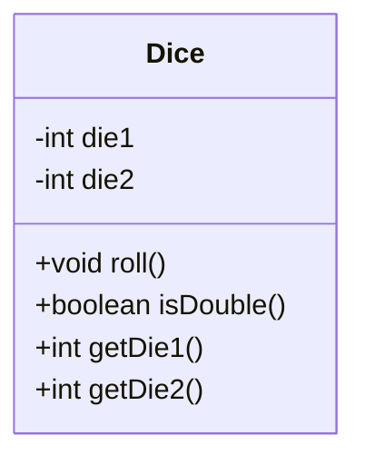

# Exercise: Dice Program with Jenkins and JUnit Testing

## Objective:
The objective of this exercise is to create a Java program that simulates rolling two dice. The program should check if the two dice show the same number. Additionally, you will set up a Jenkins pipeline to run JUnit tests for the program. Finally, you will submit screenshots of your work on Moodle.

---

## Part 1: Dice Program

### Requirements:
1. Create a Java program that simulates rolling two dice.
2. Each die should generate a random number between 1 and 6.
3. The program should check if the two dice show the same number.
4. If the numbers are the same, print "You rolled a double!" Otherwise, print "Try again."
5. Add a function to count how many times the dice are rolled before a double is achieved.
6. Write JUnit tests to verify the functionality of the program.

### Example Output:

**Rolling the dice...**
**Die 1: 4**
**Die 2: 4**
**You rolled a double!**
**after 5 try both reach the same value **

## Part 2: Jenkins Setup
### Requirements:
1. Set up Jenkins on your local machine or use a cloud-based Jenkins service.

2. Create a Freestyle Project in Jenkins.

3. Configure the project to:

    - Pull the code from a Git repository (e.g., GitHub).

    - Build the project using Maven.

    - Run the JUnit tests.

4. Add a post-build action to publish the JUnit test results.

## Part 3: Submission on Moodle

### Requirements:
1. Take screenshots of the following:

- The Jenkins build console output showing the JUnit test results.

2. Submit the screenshots on Moodle.

