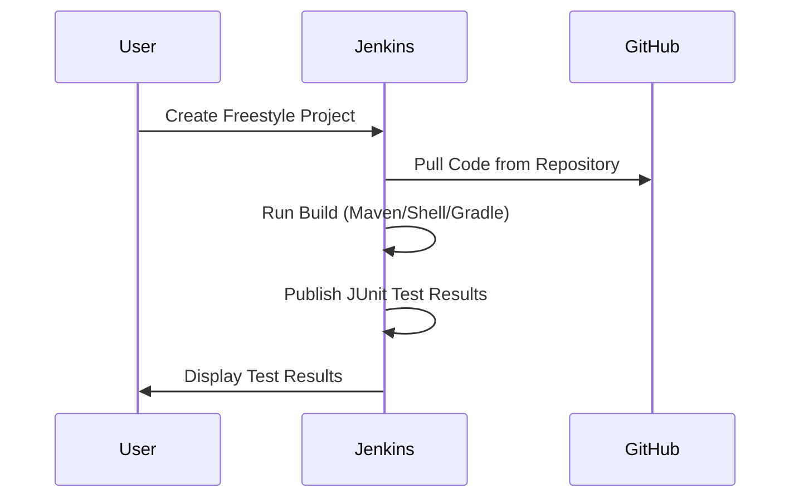
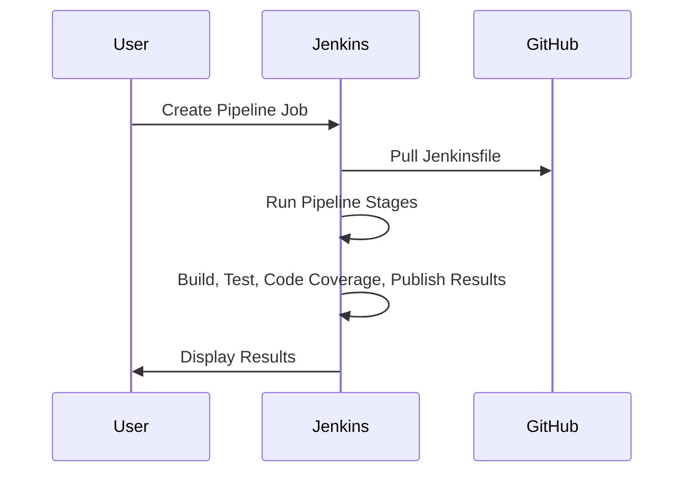
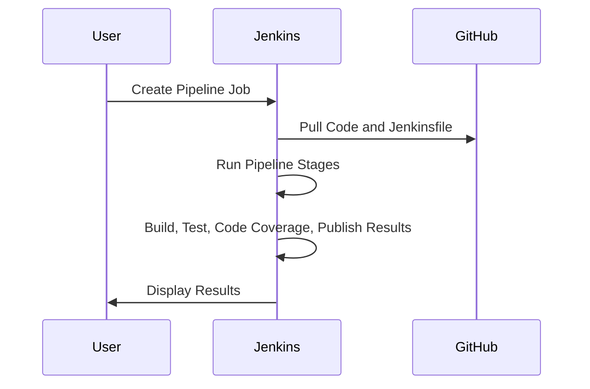

# Introduction to Jenkins

[](https://www.youtube.com/watch?v=txMyeqPDuqk)


## What is Jenkins?

Jenkins is an open-source automation server used to automate various tasks related to building, testing, and deploying software. It allows developers to continuously integrate and deliver code changes, facilitating collaboration and speeding up the software development process.

## Why Use Jenkins?

### 1. Continuous Integration

Jenkins promotes the practice of continuous integration (CI), where developers frequently merge their code changes into a shared repository. Jenkins automates the process of building and testing these changes, providing rapid feedback to developers and helping to identify issues early in the development cycle.

### 2. Automated Testing

Jenkins integrates with various testing frameworks, allowing developers to automate the execution of unit tests, integration tests, and other types of tests. This ensures that code changes do not introduce regressions and maintain code quality.

### 3. Continuous Deployment

With Jenkins, developers can automate the deployment of applications to various environments, such as development, staging, and production. This streamlines the deployment process and reduces the risk of manual errors.

### 4. Extensibility

Jenkins offers a wide range of plugins that extend its functionality, allowing users to integrate with other tools and technologies seamlessly. This flexibility makes Jenkins suitable for a variety of software development workflows and environments.

> **figure ilustrate the use of Jenkins*
 

# How to Use Jenkins
   # Essential Jenkins settings

###  Installation

1. Download Jenkins from the official website: [https://www.jenkins.io/download/](https://www.jenkins.io/download/).
2. Follow the installation instructions for your operating system.
3. Or for windows [For Windows](https://www.jenkins.io/download/thank-you-downloading-windows-installer/)
4. Run the `jenkins.msi` and follow the installation instruction
 - In case you are prompted to enter the _ admin _  password for admin login, open given path at the screen open the link in your file explorer.


## 1. Settings  JDK, Maven, and Git in Jenkins

Follow these instructions to configure **JDK**, **Maven**, and **Git** in your Jenkins environment.


## 2. Set Up JDK in Jenkins

### Step 1: Install JDK
- Download and install the **JDK** (Java Development Kit) from the [official Oracle site](https://www.oracle.com/java/technologies/javase-downloads.html) or [OpenJDK](https://openjdk.java.net/).
- Ensure you have **JDK11**, **JDK17**, and **JDK21** or later installed.


### Step 2: Configure JDK in Jenkins
1. In the Jenkins dashboard, go to __**Manage Jenkins**__.
2. Click **Global Tool Configuration**.
3. Scroll down to the **JDK** section.
4. Click **Add JDK**.
    - Uncheck the "Install automatically" option if JDK is already installed on your system.
    - Provide a **Name** for the JDK (e.g., `JDK 21`).
    - Enter the **JAVA_HOME** path for your installed JDK.
5. Click **Save**.


   

--------------------------------------------------------------------------------------------

## 4. Set Up Maven in Jenkins

### Step 1: Install Maven
- Download and install **Maven** from the [official Maven website](https://maven.apache.org/download.cgi).
- Set up the environment variables:
    - Add Maven's `bin` folder to the `PATH`.
    - Ensure you have **Maven 3.6.0** or later.

### Step 2: Configure Maven in Jenkins
1. In the Jenkins dashboard, go to __**Manage Jenkins**__.
2. Click **Global Tool Configuration**.
3. Scroll down to the **Maven** section.
4. Click **Add Maven**.
    - Uncheck the "Install automatically" option if Maven is already installed on your system.
    - Provide a **Name** for Maven (e.g., `Maven 3.8.1`).
    - Enter the **Maven Home** directory path where Maven is installed.
5. Click **Save**.


-------------------------------------------------------------------------------------------

## 5. Set Up Git in Jenkins

### Step 1: Install Git
- Download and install **Git** from the [official Git website](https://git-scm.com/downloads).
- Verify the installation by running the following command in your terminal:
    ```bash
    git --version
    ```


### Step 2: Configure Git in Jenkins
1. In the Jenkins dashboard, go to **Manage Jenkins**.
2. Click **Global Tool Configuration**.
3. Scroll down to the **Git** section.
4. Click **Add Git** (if it is not already listed).
    - Jenkins will automatically detect Git if it is installed.
5. Click **Save**.


----------------------------------------------------------------------

### Step 2: Configure the plugins
1. follow the following screenshot


   
3. Insall also Ocean Blue...


------------------------------------------------------------------
## Step 3: Practical Example
### Step 1: Create a Test Job
1. Run the jenkins in your local machine:
  - You have to find the jenkins.war in your local machine 
   ```cmd
       c:\ your_folder\ java -jar jenkins.war
   ```
- After successfully run the 


1. Open your web browser.
2. Go to `http://localhost:8080/` or the appropriate Jenkins server URL.
3. Log in using your admin credentials.


2. Click on "New Item" on the Jenkins dashboard to create a new job.
3. Enter a name for your job and choose the type of project (freestyle project).

4. Configure the job settings, including source code management, and build steps.
5. Configure your build steps to execute tasks such as compiling code, running tests, and packaging artifacts.


5. Apply and save

### Step 4: Build and Test Your Project

1. Run the job manually or configure it to run automatically based on triggers, such as code commits or scheduled builds.


### Step 5: Monitor Build Results

1. Jenkins provides detailed build logs and reports, allowing you to monitor the progress and outcome of each build.

   

3. Use the built-in dashboard and plugins to visualize build trends, test results, and other metrics.

## Creating a Java Application in IntelliJ IDEA

````mermaid
graph LR
    A[Developer Pushes Code to GitHub] -->|Push Event| B[GitHub Repository]
    B -->|Webhook Trigger| C[Jenkins CI Server]
    C --> D[Checkout Source Code from GitHub]
    D --> E[Build Maven Project]
    E -->|mvn clean install| F[Run Unit Tests]
    F --> G[Generate Test Reports]
    G --> H[Store Results and Logs]
    H --> I[Notify Developers via Email/Slack]
    F -->|Tests Passed| J[Deploy to Staging]
    F -->|Tests Failed| K[Notify Developers of Failure]

    subgraph GitHub
        B
    end

    subgraph Jenkins CI/CD
        C --> D --> E --> F --> G --> H --> I
        F --> J
        F --> K
    end


````
# Summary of the steps (How to do from developer perspective)

### Step 1: Create a New Java Project

1. Open IntelliJ IDEA and select "Create New Project" from the welcome screen.

2. Choose "Java" from the left-hand menu and click "Next."

3. Fill in the project name and location, then click "Finish" to create the project.

### Step 2: Write Java Code

1. Create a new Java class by right-clicking on the `src` folder and selecting "New -> Java Class".

2. Write your Java code in the newly created class file.

### Step 3: Build and Run the Application

1. Build the project by selecting "Build -> Build Project" from the IntelliJ IDEA menu.

2. Run the application by right-clicking on the main class file and selecting "Run <classname>".


-------------------------------------------------------------


# Practical Example (JENKINS JOB)

# Using Jenkins for JUnit Testing and Code Coverage (temp_converter will be use as a java app, (https://github.com/ADirin/TempConverter.git)


## 1. Using a Freestyle Project in Jenkins

### Steps to Set Up a Freestyle Job for JUnit Testing

1. **Go to Jenkins Dashboard**
   - Navigate to the Jenkins dashboard.

2. **Create a New Freestyle Project**
   - Click on "New Item".
   - Enter the job name.
   - Select "Freestyle project" and click "OK".

3. **Configure Source Code Management (SCM)**
   - Under "Source Code Management", select Git.
   - In "Repository URL", provide the URL to your GitHub repository (e.g., `https://github.com/your-username/your-repo.git`).
   - Optionally, specify the branch you want to build (e.g., `main` or `master`).

4. **Build Triggers (Optional)**
   - Configure Jenkins to automatically pull and run tests when changes are detected using Poll SCM or GitHub Webhooks.

5. **Build Steps**
   - In the "Build" section, add a Build Step to run JUnit tests.
     - For Maven: Select "Invoke top-level Maven targets" and specify the goals: `clean test`.
     - For Shell or Gradle: Add a Build Step to execute commands directly:
       - For shell: Choose "Execute Shell" and run `mvn clean test`.

6. **Post-Build Actions**
   - To capture JUnit results, add "Post-build Actions":
     - Choose "Publish JUnit test result report".
     - In "Test Report XMLs", enter the path to the generated XML test reports (e.g., `target/surefire-reports/*.xml` for Maven projects).

7. **Save and Run**
   - Save the job and click "Build Now" to run the tests.

### Sequence Diagram



---------------------------

# using pipeline:

# Modify Pipeline to Use Declarative Syntax Correctly

Make sure your pipeline stages are clearly defined and contain actual steps. In your current script, you only have one stage, which might be too minimal to display a clear visual pipeline. You can add multiple stages and steps to see the pipeline stages more clearly.

## Example with Multiple Stages:

```groovy
pipeline {
    agent any
    stages {
        stage('Compile') {
            steps {
                echo 'Compile stage completed'
            }
        }
        stage('Test') {
            steps {
                echo 'Test stage completed'
            }
        }
        stage('Deploy') {
            steps {
                echo 'Deploy stage completed'
            }
        }
    }
}
```


## 2. Using a Pipeline with a Jenkinsfile in GitHub

### Steps to Set Up a Jenkins Pipeline with a Jenkinsfile

1. **Create a Jenkinsfile in GitHub**
   - Add a `Jenkinsfile` to your GitHub repository with the following content:

    ```groovy
    pipeline {
        agent any
        stages {
            stage('Checkout') {
                steps {
                    git 'https://github.com/your-username/your-repo.git'
                }
            }
            stage('Build') {
                steps {
                    sh 'mvn clean install'
                }
            }
            stage('Test') {
                steps {
                    sh 'mvn test'
                }
            }
            stage('Code Coverage') {
                steps {
                    sh 'mvn jacoco:report'
                }
            }
            stage('Publish Test Results') {
                steps {
                    junit '**/target/surefire-reports/*.xml'
                }
            }
            stage('Publish Coverage Report') {
                steps {
                    jacoco()
                }
            }
        }
    }
    ```
# Steps to Ensure You See the Stages:

## 1. Ensure You're Using a Multibranch or Pipeline Job
Make sure your Jenkins job is of type **Pipeline** (or **Multibranch Pipeline**). The pipeline view works best with these types of jobs.

## 2. Make Sure You Have Jenkins Blue Ocean Installed (Optional)
**Blue Ocean** is a plugin that provides a better UI for Jenkins pipelines, making it easier to visualize stages.
If you don't have it installed:
1. Go to **Manage Jenkins > Manage Plugins**.
2. Search for **Blue Ocean** under the "Available" tab and install it.
3. Once installed, you can view your pipeline visually by clicking on the **Blue Ocean** option in the Jenkins dashboard.

## 3. Run the Pipeline Job
1. Click on **Build Now** for your pipeline job.
2. Go to **Build History > Console Output** to view the output.
3. If **Blue Ocean** is installed, you can also view the graphical representation of the pipeline by clicking on the **Blue Ocean** link.

## 4. Check the Stages Tab
Even without **Blue Ocean**, the regular Jenkins UI should show a **Stages** tab or **Pipeline Steps** in the pipeline build details, where you can see each of your pipeline stages and their status (e.g., Passed, Failed, etc.).
---------------------------------------------------------------------------------------------------------------------------------------------------------------

2. **Create a Pipeline Job in Jenkins**
   - Go to Jenkins dashboard.
   - Click on "New Item".
   - Enter a job name.
   - Select "Pipeline" and click "OK".

3. **Configure the Pipeline**
   - Under the "Pipeline" section, set "Definition" to "Pipeline script from SCM".
   - Select "Git" as SCM and provide your GitHub repository URL.
   - In "Script Path", enter `Jenkinsfile`.

4. **Save and Run**
   - Save the job and click "Build Now" to run the pipeline.

### Sequence Diagram



---

## 3. Creating a Jenkins Pipeline

### Steps to Create a Declarative Pipeline

1. **Create a New Pipeline Job in Jenkins**
   - Go to Jenkins dashboard.
   - Click on "New Item".
   - Enter a job name.
   - Select "Pipeline" and click "OK".

2. **Configure the Pipeline**
   - Under the "Pipeline" section, choose "Pipeline script" and write the following script:

    ```groovy
    pipeline {
        agent any
        stages {
            stage('Checkout') {
                steps {
                    git 'https://github.com/your-username/your-repo.git'
                }
            }
            stage('Build') {
                steps {
                    sh 'mvn clean install'
                }
            }
            stage('Test') {
                steps {
                    sh 'mvn test'
                }
            }
            stage('Code Coverage') {
                steps {
                    sh 'mvn jacoco:report'
                }
            }
            stage('Publish Test Results') {
                steps {
                    junit '**/target/surefire-reports/*.xml'
                }
            }
            stage('Publish Coverage Report') {
                steps {
                    jacoco()
                }
            }
        }
    }
    ```

3. **Save and Run**
   - Save the job and click "Build Now" to run the pipeline.

### Sequence Diagram




