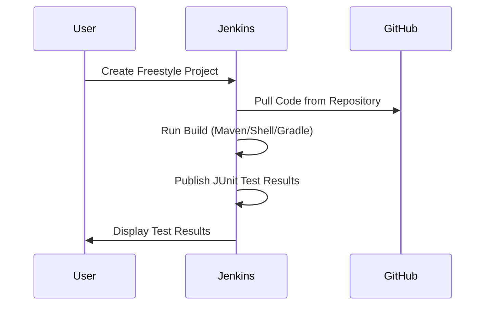
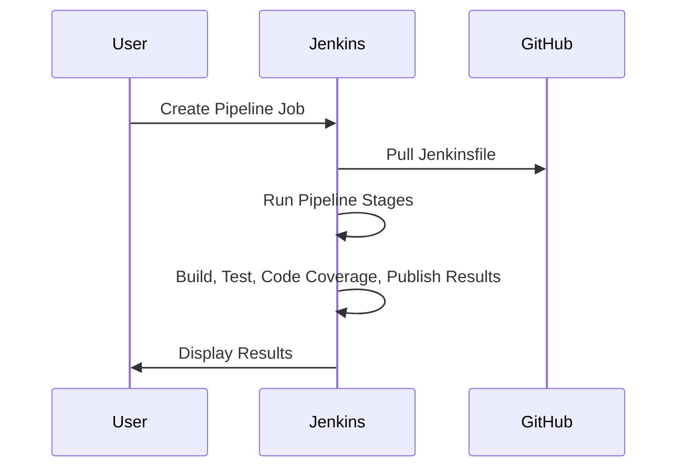
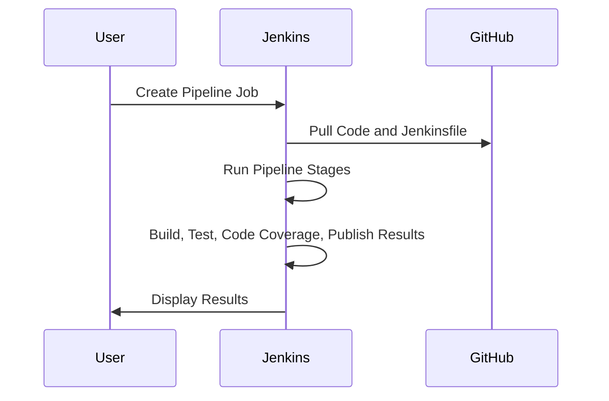

# Setting Up JDK, Maven, and Git in Jenkins

Follow these instructions to configure **JDK**, **Maven**, and **Git** in your Jenkins environment.

## 1. Install Jenkins
Before setting up JDK, Maven, and Git, ensure you have Jenkins installed and running on your system.

- You can download Jenkins from the [official Jenkins site](https://www.jenkins.io/download/).
- Follow the installation steps for your operating system.

## 2. Access Jenkins Dashboard
Once Jenkins is installed:
1. Open your web browser.
2. Go to `http://localhost:8080/` or the appropriate Jenkins server URL.
3. Log in using your admin credentials.

---

## 3. Set Up JDK in Jenkins

### Step 1: Install JDK
- Download and install the **JDK** (Java Development Kit) from the [official Oracle site](https://www.oracle.com/java/technologies/javase-downloads.html) or [OpenJDK](https://openjdk.java.net/).
- Ensure you have **JDK 8** or later installed.

### Step 2: Configure JDK in Jenkins
1. In the Jenkins dashboard, go to **Manage Jenkins**.
2. Click **Global Tool Configuration**.
3. Scroll down to the **JDK** section.
4. Click **Add JDK**.
    - Uncheck the "Install automatically" option if JDK is already installed on your system.
    - Provide a **Name** for the JDK (e.g., `JDK 11`).
    - Enter the **JAVA_HOME** path for your installed JDK.
5. Click **Save**.

---

## 4. Set Up Maven in Jenkins

### Step 1: Install Maven
- Download and install **Maven** from the [official Maven website](https://maven.apache.org/download.cgi).
- Set up the environment variables:
    - Add Maven's `bin` folder to the `PATH`.
    - Ensure you have **Maven 3.6.0** or later.

### Step 2: Configure Maven in Jenkins
1. In the Jenkins dashboard, go to **Manage Jenkins**.
2. Click **Global Tool Configuration**.
3. Scroll down to the **Maven** section.
4. Click **Add Maven**.
    - Uncheck the "Install automatically" option if Maven is already installed on your system.
    - Provide a **Name** for Maven (e.g., `Maven 3.8.1`).
    - Enter the **Maven Home** directory path where Maven is installed.
5. Click **Save**.

---

## 5. Set Up Git in Jenkins

### Step 1: Install Git
- Download and install **Git** from the [official Git website](https://git-scm.com/downloads).
- Verify the installation by running the following command in your terminal:
    ```bash
    git --version
    ```

### Step 2: Configure Git in Jenkins
1. In the Jenkins dashboard, go to **Manage Jenkins**.
2. Click **Global Tool Configuration**.
3. Scroll down to the **Git** section.
4. Click **Add Git** (if it is not already listed).
    - Jenkins will automatically detect Git if it is installed.
5. Click **Save**.

---

## 6. Verify Configuration

### Step 1: Create a Test Job
1. In the Jenkins dashboard, click **New Item**.
2. Create a **Freestyle Project** or **Pipeline**.
3. Under **Build Environment**, verify if Jenkins recognizes the **JDK**, **Maven**, and **Git** installations.
4. Run a test build to ensure everything is configured correctly.

### Step 2: Check Build Output
1. Click on **Build Now** for the test job.
2. Navigate to **Build History > Console Output**.
3. Check for logs that show the correct versions of **JDK**, **Maven**, and **Git** being used.

---

By following these steps, you will have successfully configured JDK, Maven, and Git in Jenkins, allowing you to run Java-based projects with Maven builds.


-----------------------------------------------------------------------
# Using Jenkins for JUnit Testing and Code Coverage (temp_converter will be use as a java app, (https://github.com/ADirin/TempConverter.git))

## 1. Using a Freestyle Project in Jenkins

### Steps to Set Up a Freestyle Job for JUnit Testing

1. **Go to Jenkins Dashboard**
   - Navigate to the Jenkins dashboard.

2. **Create a New Freestyle Project**
   - Click on "New Item".
   - Enter the job name.
   - Select "Freestyle project" and click "OK".

3. **Configure Source Code Management (SCM)**
   - Under "Source Code Management", select Git.
   - In "Repository URL", provide the URL to your GitHub repository (e.g., `https://github.com/your-username/your-repo.git`).
   - Optionally, specify the branch you want to build (e.g., `main` or `master`).

4. **Build Triggers (Optional)**
   - Configure Jenkins to automatically pull and run tests when changes are detected using Poll SCM or GitHub Webhooks.

5. **Build Steps**
   - In the "Build" section, add a Build Step to run JUnit tests.
     - For Maven: Select "Invoke top-level Maven targets" and specify the goals: `clean test`.
     - For Shell or Gradle: Add a Build Step to execute commands directly:
       - For shell: Choose "Execute Shell" and run `mvn clean test`.

6. **Post-Build Actions**
   - To capture JUnit results, add "Post-build Actions":
     - Choose "Publish JUnit test result report".
     - In "Test Report XMLs", enter the path to the generated XML test reports (e.g., `target/surefire-reports/*.xml` for Maven projects).

7. **Save and Run**
   - Save the job and click "Build Now" to run the tests.

### Sequence Diagram



---------------------------

# using pipeline:

# Modify Pipeline to Use Declarative Syntax Correctly

Make sure your pipeline stages are clearly defined and contain actual steps. In your current script, you only have one stage, which might be too minimal to display a clear visual pipeline. You can add multiple stages and steps to see the pipeline stages more clearly.

## Example with Multiple Stages:

```groovy
pipeline {
    agent any
    stages {
        stage('Compile') {
            steps {
                echo 'Compile stage completed'
            }
        }
        stage('Test') {
            steps {
                echo 'Test stage completed'
            }
        }
        stage('Deploy') {
            steps {
                echo 'Deploy stage completed'
            }
        }
    }
}
```


## 2. Using a Pipeline with a Jenkinsfile in GitHub

### Steps to Set Up a Jenkins Pipeline with a Jenkinsfile

1. **Create a Jenkinsfile in GitHub**
   - Add a `Jenkinsfile` to your GitHub repository with the following content:

    ```groovy
    pipeline {
        agent any
        stages {
            stage('Checkout') {
                steps {
                    git 'https://github.com/your-username/your-repo.git'
                }
            }
            stage('Build') {
                steps {
                    sh 'mvn clean install'
                }
            }
            stage('Test') {
                steps {
                    sh 'mvn test'
                }
            }
            stage('Code Coverage') {
                steps {
                    sh 'mvn jacoco:report'
                }
            }
            stage('Publish Test Results') {
                steps {
                    junit '**/target/surefire-reports/*.xml'
                }
            }
            stage('Publish Coverage Report') {
                steps {
                    jacoco()
                }
            }
        }
    }
    ```
# Steps to Ensure You See the Stages:

## 1. Ensure You're Using a Multibranch or Pipeline Job
Make sure your Jenkins job is of type **Pipeline** (or **Multibranch Pipeline**). The pipeline view works best with these types of jobs.

## 2. Make Sure You Have Jenkins Blue Ocean Installed (Optional)
**Blue Ocean** is a plugin that provides a better UI for Jenkins pipelines, making it easier to visualize stages.
If you don't have it installed:
1. Go to **Manage Jenkins > Manage Plugins**.
2. Search for **Blue Ocean** under the "Available" tab and install it.
3. Once installed, you can view your pipeline visually by clicking on the **Blue Ocean** option in the Jenkins dashboard.

## 3. Run the Pipeline Job
1. Click on **Build Now** for your pipeline job.
2. Go to **Build History > Console Output** to view the output.
3. If **Blue Ocean** is installed, you can also view the graphical representation of the pipeline by clicking on the **Blue Ocean** link.

## 4. Check the Stages Tab
Even without **Blue Ocean**, the regular Jenkins UI should show a **Stages** tab or **Pipeline Steps** in the pipeline build details, where you can see each of your pipeline stages and their status (e.g., Passed, Failed, etc.).
---------------------------------------------------------------------------------------------------------------------------------------------------------------

2. **Create a Pipeline Job in Jenkins**
   - Go to Jenkins dashboard.
   - Click on "New Item".
   - Enter a job name.
   - Select "Pipeline" and click "OK".

3. **Configure the Pipeline**
   - Under the "Pipeline" section, set "Definition" to "Pipeline script from SCM".
   - Select "Git" as SCM and provide your GitHub repository URL.
   - In "Script Path", enter `Jenkinsfile`.

4. **Save and Run**
   - Save the job and click "Build Now" to run the pipeline.

### Sequence Diagram



---

## 3. Creating a Jenkins Pipeline

### Steps to Create a Declarative Pipeline

1. **Create a New Pipeline Job in Jenkins**
   - Go to Jenkins dashboard.
   - Click on "New Item".
   - Enter a job name.
   - Select "Pipeline" and click "OK".

2. **Configure the Pipeline**
   - Under the "Pipeline" section, choose "Pipeline script" and write the following script:

    ```groovy
    pipeline {
        agent any
        stages {
            stage('Checkout') {
                steps {
                    git 'https://github.com/your-username/your-repo.git'
                }
            }
            stage('Build') {
                steps {
                    sh 'mvn clean install'
                }
            }
            stage('Test') {
                steps {
                    sh 'mvn test'
                }
            }
            stage('Code Coverage') {
                steps {
                    sh 'mvn jacoco:report'
                }
            }
            stage('Publish Test Results') {
                steps {
                    junit '**/target/surefire-reports/*.xml'
                }
            }
            stage('Publish Coverage Report') {
                steps {
                    jacoco()
                }
            }
        }
    }
    ```

3. **Save and Run**
   - Save the job and click "Build Now" to run the pipeline.

### Sequence Diagram


