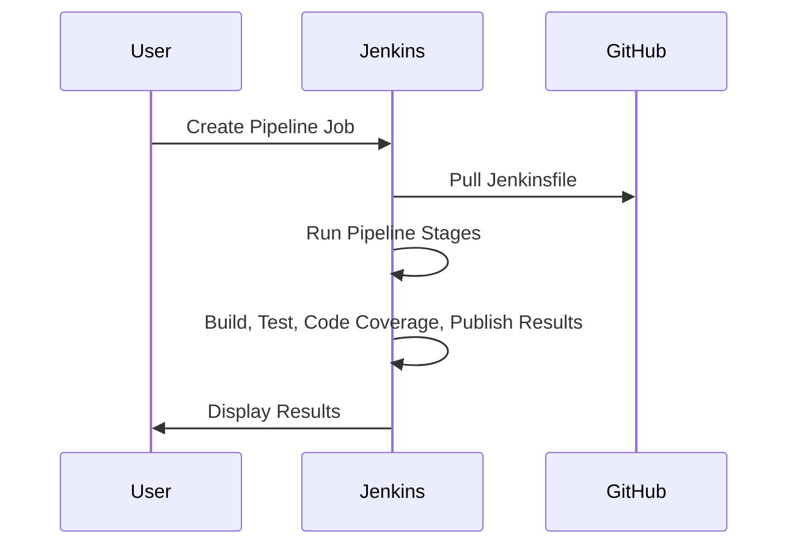
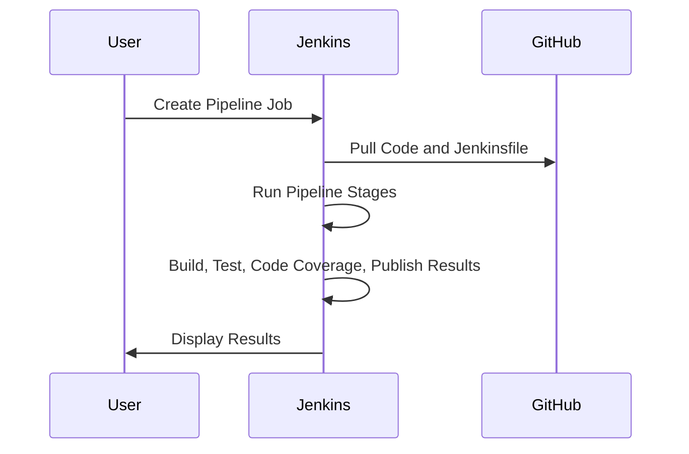

#  Using pipeline in Jenkins:

Jenkins Pipeline is a powerful tool for managing complex build and deployment workflows, making it an essential skill for students interested in DevOps and continuous integration/continuous delivery (CI/CD).

## Jenkins Pipeline
**Jenkins Pipeline** is a suite of plugins in Jenkins, an open-source automation server, that supports implementing and integrating continuous delivery pipelines. It allows you to define your entire build process, from code commit to deployment, as code. This is done using a domain-specific language (DSL) called Groovy.

### Key Features:
- **Declarative and Scripted Pipelines**: Two types of syntax to define your pipeline, making it flexible and easy to use.
- **Stages and Steps**: Break down your pipeline into stages (e.g., Build, Test, Deploy) and steps (individual tasks within stages).
- **Version Control Integration**: Easily integrate with Git, SVN, and other version control systems.
- **Extensibility**: Add plugins to extend Jenkins' functionality, such as integrating with various tools and platforms.

### Benefits:
- **Automation**: Automate repetitive tasks, reducing manual errors.
- **Consistency**: Ensure consistent build and deployment processes.
- **Visibility**: Gain insights into your pipeline's status and performance through visualizations and logs.


# Modify Pipeline to Use Declarative Syntax Correctly

Make sure your pipeline stages are clearly defined and contain actual steps. In your current script, you only have one stage, which might be too minimal to display a clear visual pipeline. You can add multiple stages and steps to see the pipeline stages more clearly.

## Options for Applying Pipelines in Jenkins

There are several ways to apply pipelines in Jenkins, each with its own advantages. Here are some common options:

### 1. Jenkinsfile in GitHub
- **Description**: Store your pipeline definition in a `Jenkinsfile` within your project's repository on GitHub.
- **Advantages**:
  - **Version Control**: Track changes to your pipeline alongside your code.
  - **Collaboration**: Easily share and review pipeline code with team members.
  - **Consistency**: Ensure the same pipeline is used across different Jenkins instances.

### 2. Pipeline Script Directly in Jenkins
- **Description**: Write and manage your pipeline script directly within the Jenkins user interface.
- **Advantages**:
  - **Quick Setup**: Easily create and modify pipelines without needing to push changes to a repository.
  - **Immediate Feedback**: Test and debug pipeline scripts directly in Jenkins.

### 3. Shared Libraries
- **Description**: Use shared libraries to define reusable pipeline code that can be used across multiple projects.
- **Advantages**:
  - **Reusability**: Share common pipeline code across different projects.
  - **Maintainability**: Centralize updates and maintenance of pipeline code.

### 4. Declarative vs. Scripted Pipelines
- **Declarative Pipelines**:
  - **Description**: Use a simplified, structured syntax to define your pipeline.
  - **Advantages**: Easier to read and write, with built-in error handling and validation.
- **Scripted Pipelines**:
  - **Description**: Use Groovy scripting for more complex and flexible pipeline definitions.
  - **Advantages**: Greater control and flexibility for advanced use cases.

### 5. Pipeline as Code with Multibranch Pipelines
- **Description**: Automatically create pipelines for each branch in your repository.
- **Advantages**:
  - **Branch-Specific Pipelines**: Customize pipelines for different branches.
  - **Automation**: Automatically detect and create pipelines for new branches.

Each method has its own use cases and benefits, so you can choose the one that best fits your project's needs.


## Example with Multiple Stages:
Sample pom.xml
```xml

   
    <properties>
        <maven.compiler.release>21</maven.compiler.release>
        <project.build.sourceEncoding>UTF-8</project.build.sourceEncoding>
    </properties>

    <dependencies>
        <dependency>
            <groupId>org.junit.jupiter</groupId>
            <artifactId>junit-jupiter</artifactId>
            <version>5.11.1</version>
            <scope>test</scope>
        </dependency>
        <dependency>
            <groupId>junit</groupId>
            <artifactId>junit</artifactId>
            <version>4.13.2</version>
            <scope>test</scope>
        </dependency>
    </dependencies>

    <build>
        <finalName>cal</finalName>
        <plugins>
            <!-- Maven Compiler Plugin -->
            <plugin>
                <groupId>org.apache.maven.plugins</groupId>
                <artifactId>maven-compiler-plugin</artifactId>
                <version>3.13.0</version>
                <configuration>
                    <release>23</release>
                    <compilerArgs>
                        <arg>--enable-preview</arg>
                    </compilerArgs>
                </configuration>
            </plugin>

            <!-- Maven Jar Plugin -->
            <plugin>
                <groupId>org.apache.maven.plugins</groupId>
                <artifactId>maven-jar-plugin</artifactId>
                <version>3.4.1</version>
                <configuration>
                    <archive>
                        <manifest>
                            <mainClass>Cal</mainClass>
                        </manifest>
                    </archive>
                </configuration>
            </plugin>

            <!-- JaCoCo Code Coverage Plugin -->
            <plugin>
                <groupId>org.jacoco</groupId>
                <artifactId>jacoco-maven-plugin</artifactId>
                <version>0.8.12</version>
                <executions>
                    <execution>
                        <goals>
                            <goal>prepare-agent</goal>
                        </goals>
                    </execution>
                    <execution>
                        <id>report</id>
                        <phase>prepare-package</phase>
                        <goals>
                            <goal>report</goal>
                        </goals>
                    </execution>
                </executions>
            </plugin>

            <!-- Surefire Plugin for Running Tests -->
            <plugin>
                <groupId>org.apache.maven.plugins</groupId>
                <artifactId>maven-surefire-plugin</artifactId>
                <version>3.5.1</version>
                <configuration>
                    <includes>
                        <include>**/*Test.java</include>
                    </includes>
                </configuration>
            </plugin>
        </plugins>
    </build>


```

```groovy
pipeline {
    agent any
    stages {
        stage('Compile') {
            steps {
                echo 'Compile stage completed'
            }
        }
        stage('Test') {
            steps {
                echo 'Test stage completed'
            }
        }
        stage('Deploy') {
            steps {
                echo 'Deploy stage completed'
            }
        }
    }
}
```


## 2. Using a Pipeline with a Jenkinsfile in GitHub

### Steps to Set Up a Jenkins Pipeline with a Jenkinsfile

1. **Create a Jenkinsfile in GitHub**
   - Add a `Jenkinsfile` to your GitHub repository with the following content:
   - **NOTE**: if you want to use the following pipeline in windows environment make sure
     1. replace sh to **bat** throughout the following script, for Linux or Mac OS the sh works fine
     2. You have to add the git-repo link in the git tag

    ```groovy
    pipeline {
        agent any
        stages {
            stage('Checkout') {
                steps {
                    git 'https://github.com/your-username/your-repo.git'
                }
            }
            stage('Build') {
                steps {
                    sh 'mvn clean install'
                }
            }
            stage('Test') {
                steps {
                    sh 'mvn test'
                }
            }
            stage('Code Coverage') {
                steps {
                    sh 'mvn jacoco:report'
                }
            }
            stage('Publish Test Results') {
                steps {
                    junit '**/target/surefire-reports/*.xml'
                }
            }
            stage('Publish Coverage Report') {
                steps {
                    jacoco()
                }
            }
        }
    }
    ```
# Steps to Ensure You See the Stages:

## 1. Ensure You're Using a Multibranch or Pipeline Job
Make sure your Jenkins job is of type **Pipeline** (or **Multibranch Pipeline**). The pipeline view works best with these types of jobs.

## 2. Make Sure You Have Jenkins Blue Ocean Installed (Optional)
**Blue Ocean** is a plugin that provides a better UI for Jenkins pipelines, making it easier to visualize stages.
If you don't have it installed:
1. Go to **Manage Jenkins > Manage Plugins**.
2. Search for **Blue Ocean** under the "Available" tab and install it.
3. Once installed, you can view your pipeline visually by clicking on the **Blue Ocean** option in the Jenkins dashboard.

## 3. Run the Pipeline Job
1. Click on **Build Now** for your pipeline job.
2. Go to **Build History > Console Output** to view the output.
3. If **Blue Ocean** is installed, you can also view the graphical representation of the pipeline by clicking on the **Blue Ocean** link.

## 4. Check the Stages Tab
Even without **Blue Ocean**, the regular Jenkins UI should show a **Stages** tab or **Pipeline Steps** in the pipeline build details, where you can see each of your pipeline stages and their status (e.g., Passed, Failed, etc.).
----------------------------------------------------------------------------------------------

2. **Create a Pipeline Job in Jenkins**
   - Go to Jenkins dashboard.
   - Click on "New Item".
   - Enter a job name.
   - Select "Pipeline" and click "OK".

3. **Configure the Pipeline**
   - Under the "Pipeline" section, set "Definition" to "Pipeline script from SCM".
   - Select "Git" as SCM and provide your GitHub repository URL.
   - In "Script Path", enter `Jenkinsfile`.

4. **Save and Run**
   - Save the job and click "Build Now" to run the pipeline.

### Sequence Diagram



---

## 3. Creating a Jenkins Pipeline in GitHUb

### Steps to Create a Declarative Pipeline

1. **Create a New Pipeline Job in Jenkins**
   - Go to Jenkins dashboard.
   - Click on "New Item".
   - Enter a job name.
   - Select "Pipeline" and click "OK".

2. **Configure the Pipeline**
   - Under the "Pipeline" section, choose "Pipeline script from SCM" and add the github repository URL (public)
   - Write the following script:

    ```groovy
    pipeline {
        agent any
        stages {
            stage('Checkout') {
                steps {
                    git 'https://github.com/your-username/your-repo.git'
                }
            }
            stage('Build') {
                steps {
                    sh 'mvn clean install'
                }
            }
            stage('Test') {
                steps {
                    sh 'mvn test'
                }
            }
            stage('Code Coverage') {
                steps {
                    sh 'mvn jacoco:report'
                }
            }
            stage('Publish Test Results') {
                steps {
                    junit '**/target/surefire-reports/*.xml'
                }
            }
            stage('Publish Coverage Report') {
                steps {
                    jacoco()
                }
            }
        }
    }
    ```

3. **Save and Run**
   - Save the job and click "Build Now" to run the pipeline.

### Sequence Diagram




# Getting Started with Docker: A Comprehensive Guide

## Introduction
Docker has revolutionized the way software is developed, deployed, and managed by providing a lightweight, portable, and efficient solution for containerization. In this learning material, we will explore the fundamentals of Docker, why it's essential, how to install Docker on various platforms, how to effectively use Docker containers, and provide a practical example using Java applications.

> 


## Table of Contents
1. [Understanding Docker](#1-understanding-docker)
2. [Why Docker?](#2-why-docker)
3. [Installing Docker](#3-installing-docker)
4. [Docker Basics](#4-docker-basics)
5. [Building Docker Images](#5-building-docker-images)
6. [Running Docker Containers](#6-running-docker-containers)
7. [Docker Compose](#7-docker-compose)
8. [Example: Dockerizing a Java Application](#8-example-dockerizing-a-java-application)

## 1. Understanding Docker
Docker is a platform that enables developers to package applications and their dependencies into containers. Containers are lightweight, portable units that ensure consistent application performance across different environments, from development to production.

## 2. Why Docker?
- Docker simplifies application deployment by creating a consistent environment, regardless of the host machine. It improves efficiency, speeds up development, reduces compatibility issues, and allows for easier scaling and isolation of apps.

- A container is a lightweight, standalone, executable software package.
- Containers encapsulate an application, along with its dependencies and runtime environment, ensuring consistency across different environment
- Containers offer several advantages in SD and deployment:
  - **Consistency:**, ensure consistency across different platform
  - **Isolation:** Containers provide isolation at the OS level, allowing multiple applications to run independently on the same host without interfering with each other.
  - **Portability:** Application and dependencies into a single unit.
  - **Scalability:** it is lightweight and fast to start.
  - **Resource Efficiency:** Share the host system’s kernel.
    
Example: What are the requirements for that Java app on one computer to run on another computer? Operating System, JVM, APP.


 - How about different entities use different technologies and environment such as Operating System or JVM?

## What is container?
- A container, such as Docker, is a lightweight, standalone, executable package of software that includes everything needed to run an application: code, runtime, system tools, system libraries, and settings. 
- A container provides an isolated environment for code, with no knowledge of the operating system or files outside the container. 
- Docker is an open platform for developing, shipping, and running applications.
- The ship takes care of everything about the container. Furthermore, the container can carry out everything regardless of the item type…
  
  How Docker works?


     

### Step to use Docker
1. Install Docker in yor machine
2. Build a docker image
   - Docker image is used to create your running application. It includes the instructions on creating the docker image
3. Run the docker container from the docker image.

      


### Standard Application Execution
In a **standard application execution**, the app runs directly on the host operating system, utilizing system resources such as memory, CPU, and disk. It depends on the host environment for libraries, frameworks, and configurations, which can lead to compatibility issues across different systems.


 

### Virtual Machine Execution
A **virtual machine (VM)** runs applications on a completely isolated, virtualized environment that includes its own operating system and virtual hardware. This allows multiple VMs to run on a single physical machine, providing isolation between applications, but VMs can be resource-heavy due to the overhead of running a full OS for each instance.


### Docker Execution
**Docker** uses lightweight containers to run applications in isolated environments. Unlike VMs, Docker containers share the host system's OS kernel but encapsulate everything else (libraries, dependencies). This allows faster startup, lower overhead, and easy portability, making it an efficient way to deploy applications across various environments.


## 3. Installing Docker
Docker installation involves downloading and setting up Docker Engine on your machine. It is available for multiple operating systems, including Linux, Windows, and macOS, with specific installation steps for each platform.


### Installing and Setting Up Docker on Different Operating Systems
[Windows](https://www.docker.com/get-started/)
- Check System Requirements: Ensure your Windows version supports Docker (Windows 10 64-bit: Pro, Enterprise, or Education; or Windows 11).
- Enable WSL 2: Install and enable Windows Subsystem for Linux 2 (WSL 2).
    `wsl --install`
- Download Docker Desktop: Get the Docker Desktop installer from the Docker website.
- Install Docker Desktop: Run the installer and follow the setup instructions.
- Start Docker Desktop: Launch Docker Desktop and complete the initial setup.
- Verify Installation: Open a terminal and run:
    `docker --version`

  
[macOS](https://docs.docker.com/desktop/install/mac-install/)
- Check System Requirements: Ensure your macOS version is 10.15 or newer.
- Download Docker Desktop: Get the Docker Desktop installer from the Docker website.
- Install Docker Desktop: Open the downloaded .dmg file and drag Docker to the Applications folder.
- Start Docker Desktop: Launch Docker from the Applications folder and complete the initial setup.
- Verify Installation: Open a terminal and run:
  `docker --version`
  
[Linux](https://docs.docker.com/engine/install/ubuntu/) 
- Check System Requirements: Ensure your Linux distribution is supported (e.g., Ubuntu, Debian, Fedora, CentOS).
- Update Package Index: Update your package index.
`sudo apt-get update`

__Install Docker Engine:__
`sudo apt-get install docker-ce docker-ce-cli containerd.io`

- Start Docker: Enable and start the Docker service.
`sudo systemctl enable docker`
`sudo systemctl start docker`

- Verify Installation: Run the following command to check Docker version:
`docker --version`

**Post-Installation Steps (All OS)**
- Run Docker Without Sudo (Linux Only):
`sudo usermod -aG docker $USER`

- Test Docker Installation: Run a test container.
`docker run hello-world`


## 4. Docker Basics
- Docker CLI overview: `docker run`, `docker build`, `docker ps`, `docker images`, etc.
- Managing containers: starting, stopping, restarting, removing
- Inspecting container logs and stats

## 5. Building Docker Images
A Docker image is a snapshot of an application and its dependencies. You can create custom images using a Dockerfile, which defines the instructions to install software, configure environments, and set up the application.

## 6. Running Docker Containers
Containers are the running instances of Docker images. This part explains how to start, stop, and manage containers, as well as monitor their performance and logs, ensuring your app runs properly in isolation.

## 7. Docker Compose
Docker Compose allows you to define and manage multi-container applications using a YAML file. It simplifies starting multiple services (e.g., databases, web apps) together, making complex applications easier to orchestrate.


## 8. Example: Dockerizing a Java Application
- This practical example demonstrates how to package a Java application into a Docker container. You’ll create a Dockerfile, build the image, and use Docker to run the application in a containerized environment, illustrating real-world Docker use.
  

-------------------------------------------------------

# Java Development Workflow Example with GitHub, Jenkins, and Docker

## Overview
In this example, we'll illustrate a typical Java development workflow using popular tools like IntelliJ IDEA for development, GitHub for version control, Jenkins for continuous integration (CI), and Docker for containerization.

### Technologies Used:
- **Java**: Programming language used for application development.
- **IntelliJ IDEA**: Integrated Development Environment (IDE) for Java development.
- **GitHub**: Version control platform for hosting Git repositories.
- **Jenkins**: Automation server for continuous integration and continuous delivery (CI/CD).
- **Docker**: Containerization platform for packaging and deploying applications.

## Workflow Steps:

### 1. Setting up the Project
- **IntelliJ IDEA**: Create a new Java project in IntelliJ IDEA. Develop your Java application using IntelliJ's features like code editor, debugger, and built-in version control integration.

### 2. Version Control with GitHub
- **GitHub**: Initialize a Git repository for your project and push your code to GitHub. GitHub provides centralized version control, collaboration features (like pull requests and code reviews), and a remote repository for your project.

### 3. Continuous Integration with Jenkins
- **Jenkins**: Set up a Jenkins server for continuous integration. Configure Jenkins to monitor the GitHub repository for changes. Create a Jenkins pipeline or job that triggers a build process whenever changes are pushed to the GitHub repository.
- **Purpose**: Jenkins automates the build, test, and deployment processes, ensuring that changes are validated and integrated into the project in a timely manner.

### 4. Dockerizing the Application
- **Docker**: Write a Dockerfile to define the environment and dependencies required to run your Java application. Build a Docker image containing your application and its dependencies.
- **Purpose**: Docker containerizes your application, providing consistency in development, testing, and deployment environments. It also simplifies deployment by encapsulating the application and its dependencies into a portable, self-sufficient unit.

### 5. Deployment
- **Jenkins**: Extend your Jenkins pipeline or job to include deployment steps. Use Docker commands to deploy the Docker image to a container runtime environment, such as Docker Swarm or Kubernetes.
- **Purpose**: Jenkins automates the deployment process, ensuring that the latest version of the application is deployed consistently across different environments.

## Conclusion
By integrating tools like IntelliJ IDEA, GitHub, Jenkins, and Docker into your Java development workflow, you can streamline the development process, improve collaboration, automate repetitive tasks, and ensure the reliability and consistency of your software deployments. This example demonstrates the power of using an integrated toolchain to manage the entire software development lifecycle, from coding to deployment.

# How to do
Let's demonstrate how you can integrate a simple Java calculator program (Calculator.java) into the Java development workflow using IntelliJ IDEA, GitHub, Jenkins, and Docker.

## Step 1: Setting up the Project in IntelliJ IDEA
1. Open IntelliJ IDEA and create a new Java project.
2. Create a new Java class named Calculator.
3. Write your calculator logic in the Calculator.java class.

``` java
public class Calculator {

    public int subtract(int a, int b) {
        return a - b;
    }

    public int multiply(int a, int b) {
        return a * b;
    }

    public int divide(int a, int b) {
        if (b == 0) {
            throw new IllegalArgumentException("Cannot divide by zero!");
        }
        return a / b;
    }

    public static void main(String[] args){
        System.out.println("Done docker");
    }
}

```

## Write a test class for the your calculator class

```java

import org.junit.Test;

import static org.junit.Assert.assertEquals;

public class CalculatorTest {

   Calculator calculator= new Calculator();

   @Test
    public void multiplyTest(){
       assertEquals(10, calculator.multiply(5,2));
   }

    @Test
    public void subtractTest(){
        assertEquals(3, calculator.subtract(5,2));
    }

    @Test
    public void divideTest(){
        assertEquals(3, calculator.divide(6,2));
    }
}

```


## Step 2: Version Control with GitHub

1. **Initialize a Git repository for your project:**

2. **Commit your changes and push the project to a GitHub repository:**


## Step 3: Continuous Integration with Jenkins

1. **Set up a Jenkins server.**
2. **Install necessary plugins like GitHub and Docker Pipeline:**
   - In the Jenkins dashboard, navigate to "Manage Jenkins" -> "Manage Plugins" -> "Available" tab.
  
   - [plugins](/Images/plugins.JPG)
    
   - Search for and select the following plugins to install:
     - **GitHub Plugin**: Integrates Jenkins with GitHub repositories.
     - **Docker Pipeline Plugin**: Allows Jenkins to use Docker containers as part of the build process.
   - Click "Install without restart" to install the selected plugins.
3. **Create a Jenkins job that monitors the GitHub repository for changes:**
   - Click on "New Item" in the Jenkins dashboard to create a new job.
   - Enter a name for your job (e.g., "Calculator CI") and select "Freestyle project" depending on your preference.
   - Under the "Source Code Management" tab, select git and specify the GitHub project URL of your repository.
   - Enable "GitHub project" and enter the GitHub project URL.


   - Configure the job to build periodically or trigger builds based on GitHub webhook triggers (recommended for real-time builds).
   - Configure any additional build triggers or parameters as needed.
   - In the "Build" section, add a build step to execute Maven commands.
   - Specify the Maven goals to build your Java project (e.g., clean install).

   
   
   
     - If you're using a "Pipeline" job:
     - Write a Jenkinsfile (or use the Pipeline Script) to define the build pipeline stages.
     - Use the checkout step to clone the GitHub repository.
     - Use the sh step to execute Maven commands to build your Java project.
     - Here's an example Jenkinsfile:

       ```groovy
       pipeline {
           agent any
           stages {
               stage('Build') {
                   steps {
                       git 'https://github.com/your-username/your-repository.git'
                       sh 'mvn clean install'
                   }
               }
           }
       }
       ```
     
       *** - if youare using windows instead of sh you have to use bat--> bat 'mvn clean install'
4. **Save your Jenkins job configuration and run a test build to verify the setup.**

Now, Jenkins will monitor your GitHub repository for changes and automatically trigger builds whenever changes are pushed. It will build your Java project using Maven, helping you maintain a continuous integration workflow.


## Step 4: Dockerizing the Application
1. Write a Dockerfile to package your Java application into a Docker image.


   
3. Build the Docker image locally using Docker commands or Dockerfile instructions.
- right click to the Dockerfile and run.

 

 

Here's an example Dockerfile:
#### Use an official OpenJDK runtime as a parent image
`FROM maven:latest`

#### Set the working directory in the container
`WORKDIR /app`

#### Copy the application JAR file into the container at /usr/src/app
`COPY Calculator.jar .`

#### Run the JAR file
````CMD
CMD["java", "-jar", "Calculator.jar"]

````

**Sample Docker file
````txt

# Use an official Maven image as a parent image
FROM maven:latest

# Set metadata information
LABEL authors="amirdi"

# Set the working directory in the container
WORKDIR /app

# Copy the pom.xml file to the container
COPY pom.xml /app/

# Copy the entire project to the container
COPY . /app/

# Package your application
RUN mvn package

# Run the main class (assuming your application has a main class)
CMD ["java", "-jar", "target/calculator.jar"]

````
**Sample POM.XML file 
**IF you get class NOT FOUND MAKE SURE THE PATH TO THE CLASS IS CORRECT** 
```
<archive>
   <manifest>
       <mainClass>Calculator</mainClass> <!-- Correct main class -->
   </manifest>
 </archive>

```
### SAMPLE POM: Make sure you have configured the class name properly in the POM.xml. 
- Check for Main Class Configuration: In Maven, if you're working with a Java application (especially one that uses the Spring Boot or a similar framework), you need to ensure that the mainClass is defined properly in the pom.xml under the build section.
- Ensure that the mainClass value matches the class where your main method is located, otherwise the Docker image may build and run but fail at runtime due to not finding the correct entry point.
- Set the Classpath in the Dockerfile: In your Dockerfile, make sure you specify the correct entry point or the classpath for running your application.

### Common Issues to Watch For:
- Incorrect Class Name: If the class name in the pom.xml is wrong, Docker will build the image without failing but will throw errors at runtime.
- Missing Plugin Configurations: Ensure all necessary Maven plugins are correctly configured to avoid issues with Docker execution.
- Maven Build Phases: Make sure that Maven's package or install phase is correctly set up to create the JAR or WAR file that Docker uses.

```` xml
  
<properties>
        <maven.compiler.source>17</maven.compiler.source>
        <maven.compiler.target>17</maven.compiler.target>
        <project.build.sourceEncoding>UTF-8</project.build.sourceEncoding>
    </properties>

    <build>
        <finalName>calculator</finalName>
        <plugins>
            <!-- Compiler Plugin for setting the Java version -->
            <plugin>
                <groupId>org.apache.maven.plugins</groupId>
                <artifactId>maven-compiler-plugin</artifactId>
                <version>3.13.0</version>
                <configuration>
                    <source>17</source>
                    <target>17</target>
                </configuration>
            </plugin>

            <!-- JAR Plugin for configuring the manifest file -->
            <plugin>
                <groupId>org.apache.maven.plugins</groupId>
                <artifactId>maven-jar-plugin</artifactId>
                <version>3.4.1</version>
                <configuration>
                    <archive>
                        <manifest>
                            <mainClass>Calculator</mainClass> <!-- Correct main class -->
                        </manifest>
                    </archive>
                </configuration>
            </plugin>

            <!-- JaCoCo Plugin for code coverage -->
            <plugin>
                <groupId>org.jacoco</groupId>
                <artifactId>jacoco-maven-plugin</artifactId>
                <version>0.8.12</version>
                <executions>
                    <execution>
                        <id>jacoco-initialize</id>
                        <goals>
                            <goal>prepare-agent</goal>
                        </goals>
                    </execution>
                    <execution>
                        <id>jacoco-report</id>
                        <phase>test</phase>
                        <goals>
                            <goal>report</goal>
                        </goals>
                    </execution>
                </executions>
            </plugin>
        </plugins>
    </build>

    <dependencies>
        <!-- JUnit for testing -->
        <dependency>
            <groupId>junit</groupId>
            <artifactId>junit</artifactId>
            <version>4.13.2</version>
            <scope>test</scope>
        </dependency>
    </dependencies>

````


## Step 5: Deployment
1. Extend your Jenkins pipeline or job to include deployment steps using Docker commands to deploy the Docker image to a container runtime environment.

Note: 
1. **Main class not found is often solve by configuring the pom source file**
2. **The default jar file generated by Inttelij often very long, set a default jar file name through POM.XML see the sample**
3. **Make sure the docker hub credential match the docker file hub credential and also Jenkins gloable credential.** 
4. **Make sure that you have commited all the changes to github**

-----------------------------------------

# Create an image through jenkins pipeline

### Prior to the configuring pipeline make sure:
- Add the docker pluging through Dashbord--> manage jenkins--> plugings
    - all dockers related plugin including yet another docker pluging 
- Add the globle credentials--- Daschbord---> manage jenkins--> Creadentials:


  - Username: Make sure it’s your Docker Hub username (e.g., amirdi).
  - Password: Use your Docker Hub password or a personal access token.
  - Treat username as secret: If checked, it will conceal the username in the UI and logs, which is a good security practice.
  - ID: This should be a unique identifier for your credentials (e.g., dockerhub-credentials).
  - Description: Optionally add a description to clarify what these credentials are for.
  - Once you fill these fields, click Update to save the changes.   


```pipeline
pipeline {
    agent any // IN THE LECTURE I WILL EXPLAIN THE SCRIPT AND THE WORKFLOW

    environment {
        // Define Docker Hub credentials ID
        DOCKERHUB_CREDENTIALS_ID = 'Docker_Hub'
        // Define Docker Hub repository name
        DOCKERHUB_REPO = 'amirdirin/testdemo1'
        // Define Docker image tag
        DOCKER_IMAGE_TAG = 'latest_v1'
    }
    stages {
        stage('Checkout') {
            steps {
                // Checkout code from Git repository
                git 'https://github.com/ADirin/sep1_week6_timecal_demo.git'
            }
        }
        stage('Build Docker Image') {
            steps {
                // Build Docker image
                script {
                    docker.build("${DOCKERHUB_REPO}:${DOCKER_IMAGE_TAG}")
                }
            }
        }
        stage('Push Docker Image to Docker Hub') {
            steps {
                // Push Docker image to Docker Hub
                script {
                    docker.withRegistry('https://index.docker.io/v1/', DOCKERHUB_CREDENTIALS_ID) {
                        docker.image("${DOCKERHUB_REPO}:${DOCKER_IMAGE_TAG}").push()
                    }
                }
            }
        }
    }
}

```

