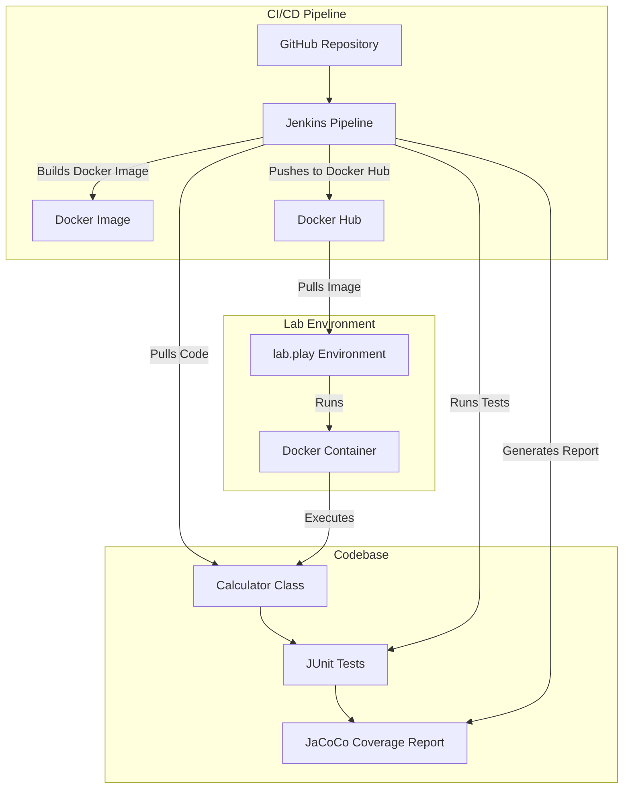
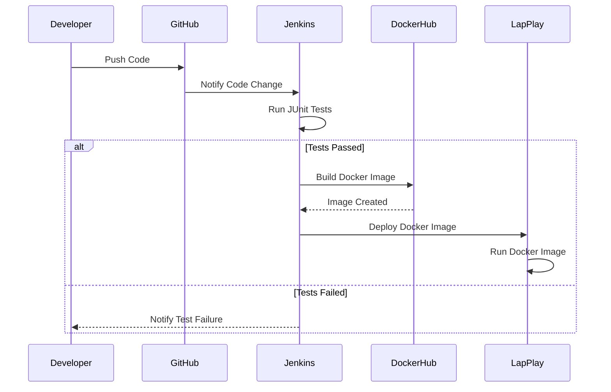

# Before Docker: 
The relationship between developers and testers was often strained due to environment inconsistencies. Developers would say, "It works on my machine," while testers struggled with bugs caused by differences in local setups. Setting up environments manually was time-consuming and prone to errors, leading to frustration on both sides.


# After Docker: 
Docker improved the relationship between developers and testers by allowing them to work in identical, containerized environments. Testers could now run the same environment as developers, reducing "works on my machine" issues. This consistency streamlined testing, improved collaboration, and minimized environment-related conflicts.


# A short process for creating a Docker image and deploying it in IntelliJ:

1. Install Docker Plugin in IntelliJ:
Go to File > Settings > Plugins and search for the Docker plugin. Install it and restart IntelliJ.
2. Create a Dockerfile:
In your project root, right-click and select New > File, name it Dockerfile.
Write your Docker instructions. Example for a Java app
```java
FROM openjdk:11
COPY . /app
WORKDIR /app
RUN javac Main.java
CMD ["java", "Main"]
```
3. Build the Docker Image:
Open the terminal in IntelliJ and run

```cmd
docker build -t your-app-name .

```
- This creates a Docker image based on the Dockerfile.

4. Run the Docker Container:
After building the image, deploy the container:
```cmd
docker run -p 8080:8080 your-app-name

```
- This starts the container and exposes it on port 8080.

5. Run and Test:
The app is now running inside a Docker container. You can access it from localhost:8080 in your browser or via API tools like Postman.
In IntelliJ, Docker integration allows you to manage containers, view logs, and monitor the deployment process all within the IDE.


## Example
```css
src
 ├── main
 │   └── java
 │       └── Calculator.java
 └── test
     └── java
         └── TestTest.java


```

## **Important Note** 
- this is a sample pom and you have to customize based on your own calss name **<mainClass>** *"YOUR OWN Main Class"*  and also change the *<finalname>* modify it for your jar filename <finalnam>

```xml
 <build>
        <finalName>tripcalaculator</finalName>
        <plugins>
            <!-- Compiler Plugin for setting the Java version -->
            <plugin>
                <groupId>org.apache.maven.plugins</groupId>
                <artifactId>maven-compiler-plugin</artifactId>
                <version>3.13.0</version>
                <configuration>
                    <source>21</source>
                    <target>21</target>
                </configuration>
            </plugin>

            <!-- JAR Plugin for configuring the manifest file -->
            <plugin>
                <groupId>org.apache.maven.plugins</groupId>
                <artifactId>maven-jar-plugin</artifactId>
                <version>3.4.2</version>
                <configuration>
                    <archive>
                        <manifest>
                            <mainClass>TripCostCalculator</mainClass> <!-- Correct main class -->
                        </manifest>
                    </archive>
                </configuration>
            </plugin>


            <!-- Other plugins like compiler, jar, jacoco... -->

            <!-- Surefire Plugin for running tests -->
            <plugin>
                <groupId>org.apache.maven.plugins</groupId>
                <artifactId>maven-surefire-plugin</artifactId>
                <version>3.2.5</version> <!-- Latest stable version -->
                <configuration>
                    <includes>
                        <include>**/Test*.java</include>
                        <include>**/*Test.java</include>
                        <include>**/*Tests.java</include>
                    </includes>
                </configuration>
            </plugin>


            <!-- JaCoCo Plugin for code coverage -->
            <plugin>
                <groupId>org.jacoco</groupId>
                <artifactId>jacoco-maven-plugin</artifactId>
                <version>0.8.12</version>
                <executions>
                    <execution>
                        <id>jacoco-initialize</id>
                        <goals>
                            <goal>prepare-agent</goal>
                        </goals>
                    </execution>
                    <execution>
                        <id>jacoco-report</id>
                        <phase>test</phase>
                        <goals>
                            <goal>report</goal>
                        </goals>
                    </execution>
                </executions>
            </plugin>
        </plugins>
    </build>

    <dependencies>
        <!-- JUnit for testing -->
        <dependency>
            <groupId>junit</groupId>
            <artifactId>junit</artifactId>
            <version>4.13.2</version>
            <scope>test</scope>
        </dependency>
        <dependency>
            <groupId>org.junit.jupiter</groupId>
            <artifactId>junit-jupiter</artifactId>
            <version>5.11.1</version>
            <scope>compile</scope>
        </dependency>

    </dependencies>
```


```java
import java.util.Scanner;

public class Calculator {
    // Constructor
    Calculator() {}

    public static void main(String[] args) {
        Calculator test = new Calculator();  // Create an instance of Test
        test.run();              // Call the run method
    }

    // Method to handle input and perform addition
    public void run() {
        Scanner sc = new Scanner(System.in);

        System.out.println("Enter the first number ");
        int num1 = sc.nextInt();

        System.out.println("Enter the second number");
        int num2 = sc.nextInt();

        int sum = addNumbers(num1, num2);
        System.out.println("Here is the sum: " + sum);
    }

    // Non-static method to add numbers
    public int addNumbers(int num1, int num2) {
        return num1 + num2;
    }
}

```
```Java
import static org.junit.jupiter.api.Assertions.assertEquals;
import org.junit.jupiter.api.Test;

public class CalculatorTest {

    Calculator testInstance = new Calculator();

    @Test
    public void testAddition() {
        // Test case 1: Positive numbers
        int num1 = 5;
        int num2 = 10;
        int expectedSum = 15;

        int actualSum = testInstance.addNumbers(num1, num2);
        assertEquals(expectedSum, actualSum);

        // Test case 2: Negative numbers
        num1 = -5;
        num2 = -10;
        expectedSum = -15;

        actualSum = testInstance.addNumbers(num1, num2);
        assertEquals(expectedSum, actualSum);

        // Test case 3: Mixed numbers
        num1 = -5;
        num2 = 10;
        expectedSum = 5;

        actualSum = testInstance.addNumbers(num1, num2);
        assertEquals(expectedSum, actualSum);
    }

    @Test
    public void testEdgeCases() {
        // Test zero case
        assertEquals(0, testInstance.addNumbers(0, 0));

        // Test large numbers
        assertEquals(Integer.MAX_VALUE, testInstance.addNumbers(Integer.MAX_VALUE, 0));

        // Test minimum integer
        assertEquals(Integer.MIN_VALUE, testInstance.addNumbers(Integer.MIN_VALUE, 0));
    }
}


```

```docker
# Use Maven image to build the application
FROM maven:latest

# Set working directory inside the container
WORKDIR /app

# Copy the pom.xml to download dependencies first (caching optimization)
COPY pom.xml /app/

# Copy the entire project to the container
COPY . /app/

# Package the application using Maven
RUN mvn package

# Run the main class from the built JAR
CMD ["java", "-jar", "target/Test.jar"]


```
```pom.xml
pipeline {
    agent any
     environment {
            // Define Docker Hub credentials ID
            DOCKERHUB_CREDENTIALS_ID = 'Docker_Hub'
            // Define Docker Hub repository name
            DOCKERHUB_REPO = 'amirdirin/week7_inclass_test1'
            // Define Docker image tag
            DOCKER_IMAGE_TAG = 'latest_v1'
        }
    stages {
        stage('Checkout') {
            steps {
                git 'https://github.com/ADirin/SEP1_Week7_Spring2025_Inclass_solution.git'
            }
        }
        stage('Build') {
            steps {
                sh 'mvn clean install'
            }
        }
        stage('Test') {
            steps {
                sh 'mvn test'
            }
        }
        stage('Code Coverage') {
            steps {
                sh 'mvn jacoco:report'
            }
        }
        stage('Publish Test Results') {
            steps {
                junit '**/target/surefire-reports/*.xml'
            }
        }
        stage('Publish Coverage Report') {
            steps {
                jacoco()
            }
        }

         stage('Build Docker Image') {
                    steps {
                        // Build Docker image
                        script {
                            docker.build("${DOCKERHUB_REPO}:${DOCKER_IMAGE_TAG}")
                        }
                    }
                }
                stage('Push Docker Image to Docker Hub') {
                    steps {
                        // Push Docker image to Docker Hub
                        script {
                            docker.withRegistry('https://index.docker.io/v1/', DOCKERHUB_CREDENTIALS_ID) {
                                docker.image("${DOCKERHUB_REPO}:${DOCKER_IMAGE_TAG}").push()
                            }
                        }
                    }
                }
    }
}

```
## Build the file in the docker consol

```cmd
docker build -t your-app-name .

```
Use the `-it` flag with docker run to run the container in interactive mode, allowing your program to wait for and accept input from the console.
```cmd
docker run -it your-app-name
```
For desktop docker use the command line for the execution


 From GitHub to Docker Hub through Jenkins

> 

Jacoco report

> 


Running the Image remotely from Hub.docker.com:

> 


Run the Images from HUB remotely

 1. open the following link [Play docker](https://labs.play-with-docker.com/)
 2. puul the image you want to test from hub.docker.com (your image repo) with the following command:
    - docker pull yourusername/imagename:ver
    - for example:
    ```cmd
   
    docker pull amirdi/devopschain:ver2
    ```
 3.  get the list of the images pulled from the docker hub
    ```cmd
       docker images
    ```
 4. run the image
 - docker run -it imageid
 - for example:
   ```cmd
    docker run -it  4cb87ade08
   ```


 

# Summery of the process

1. Developer pushes code to GitHub.
2. GitHub notifies Jenkins about the code change.
3. Jenkins runs JUnit tests.
4. If the tests pass:
    - Jenkins builds a Docker image and pushes it to DockerHub.
    - Jenkins then instructs LapPlay to deploy the Docker image.
    - LapPlay runs the Docker image.
5. If the tests fail, Jenkins notifies the Developer about the test failure.




 
---------------------------------------------------------------------
# Towards to SecDevOps

> 

-SecDevOps merges security practices with DevOps, aiming to incorporate security thinking and tools from development pipelines to deployments and production support.

SecDevOps, also known as DevSecOps, is an approach to software development that integrates security practices into the DevOps process. Traditional DevOps focuses on the rapid delivery of software through collaboration between development and operations teams. However, security often becomes an afterthought, leading to vulnerabilities and potential breaches. SecDevOps aims to address this by embedding security measures and practices throughout the entire software development lifecycle (SDLC).

## Why SecDevOps is Important
1. **Early Detection of Vulnerabilities:** By integrating security from the beginning, vulnerabilities can be identified and addressed at the earliest stages of development, reducing the risk of security breaches in production.
  
2. **Faster Response to Security Threats:** With security integrated into the development pipeline, teams can respond more quickly to security threats and implement necessary patches or fixes without disrupting the development process.

3. **Improved Compliance:** Many industries have strict regulatory requirements regarding data security and privacy. SecDevOps ensures that security measures are in place throughout development, helping organizations maintain compliance with regulations such as GDPR, HIPAA, etc.


4. **Cost Reduction:** Addressing security issues early in the development process is often more cost-effective than fixing them after deployment. SecDevOps helps reduce the potential costs associated with security breaches and compliance violations.

## Key Components of SecDevOps
1. **Automation:** Automating security testing, code analysis, and compliance checks helps ensure that security measures are consistently applied throughout the development process.
  
2. **Continuous Monitoring:** Implementing continuous monitoring tools allows teams to detect and respond to security threats in real-time, providing enhanced visibility into the security posture of applications and infrastructure.

3. **Collaboration:** SecDevOps encourages collaboration between development, operations, and security teams, breaking down silos and fostering a culture of shared responsibility for security.

## How AI Impacts SecDevOps
Artificial Intelligence (AI) is poised to revolutionize SecDevOps in several ways:

1. **Automated Threat Detection:** AI-powered tools can analyze vast amounts of data to identify patterns indicative of security threats, enabling teams to proactively detect and respond to potential attacks.
   
2. **Intelligent Automation:** AI algorithms can automate repetitive security tasks, such as vulnerability scanning and threat hunting, freeing up human resources to focus on more strategic security initiatives.

3. **Enhanced Predictive Analytics:** By leveraging machine learning models, SecDevOps teams can gain insights into future security trends and potential vulnerabilities, allowing them to preemptively address security risks before they escalate.

4. **Behavioral Analysis:** AI can analyze user and system behavior to identify anomalous activities that may indicate a security breach, enabling faster detection and response.

## Conclusion
SecDevOps represents a paradigm shift in how organizations approach software development, emphasizing the importance of integrating security into every aspect of the DevOps process. By adopting SecDevOps principles and leveraging emerging technologies like AI, organizations can build more secure and resilient software applications while accelerating delivery and reducing risk.

![SecDevOps Lifecycle] (https://users.metropolia.fi/~amirdi/SEP1/SecDevOps/DeVSecOps.JPG)
*Figure 1: SecDevOps Lifecycle*


### Example: Implementing Input Validation in a Java Application

#### Step 1: Design Phase
During the design phase, developers and security engineers collaborate to define input validation requirements for the application.

#### Step 2: Implementation

```java
public class UserAuthenticationService {
    
    public boolean authenticateUser(String username, String password) {
        // Perform input validation
        if (isValidInput(username) && isValidInput(password)) {
            // Authenticate user
            return authenticate(username, password);
        } else {
            // Log validation error
            System.err.println("Invalid input detected!");
            return false;
        }
    }
    
    private boolean isValidInput(String input) {
        // Implement input validation logic
        // For example, check for null or empty strings
        return input != null && !input.isEmpty();
    }
    
    private boolean authenticate(String username, String password) {
        // Implement authentication logic
        // For example, check against database or external service
        return username.equals("admin") && password.equals("password");
    }
    
    public static void main(String[] args) {
        UserAuthenticationService authService = new UserAuthenticationService();
        // Example usage
        boolean isAuthenticated = authService.authenticateUser("admin", "password");
        if (isAuthenticated) {
            System.out.println("Authentication successful!");
        } else {
            System.out.println("Authentication failed!");
        }
    }
}
````
### Step 3: Testing
During the testing phase, automated tests are created to validate input validation logic.

### Step 4: Continuous Integration/Continuous Deployment (CI/CD)
The application code is integrated into the CI/CD pipeline, where automated security checks, such as static code analysis and vulnerability scanning, are performed at each stage of the pipeline.

### Step 5: Monitoring
Continuous monitoring tools are implemented to detect and respond to security threats in real-time.

By following these steps and integrating security practices into the development process, you can ensure that your Java application is more secure and resilient to potential attacks.

## Different Solutions:

> 

- **Enhanced Security:**
      - SecDevOps enhances organizational security by integrating security measures consistently into the DevOps workflow, resulting in more secure end products.
- **Shifting left:**
    - This process refers to integrating security early in development, reducing risks and costs associated with late-discovery vulnerabilities.
- **Regulatory Compliance:**
      - SecDevOps streamlines compliance with industry standards and regulations by automating many monitoring and reporting tasks.


## Tools and Technologies for SecDevOps

- Static Application Security Testing (SAST):
    - Automated code review tools to identify security issues before deployment
- Dynamic Application Security Testing (DAST):
    - Simulate attacks on live applications to find runtime security flaws.
- Integration and Deployment Automation (CI/CD):
    - Tools that automate the deployment process to incorporate security checks swiftly.


