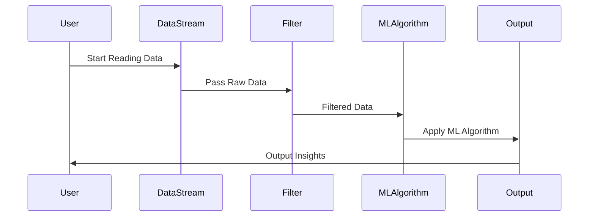

```mermaid
sequenceDiagram
    participant User
    participant DataStream
    participant Filter
    participant MLAlgorithm
    participant Output

    User->>DataStream: Start Reading Data
    DataStream->>Filter: Pass Raw Data
    Filter->>MLAlgorithm: Filtered Data
    MLAlgorithm->>Output: Apply ML Algorithm
    Output->>User: Output Insights


```
